organisation
# 0.0 Lab Zero - Zero to Cloud - Creating a basic app with a Starter Kit


This lab is an introduction to IBM Cloud and its possibilities. No need any developer skills to complete the lab. You will need an IBM Cloud account in order to create your web application.  

# Objective

+ Organise your IBM Cloud account workspace
+ Discover the IBM Cloud services catalog
+ Use one of the starter kits available to create your web application on IBM Cloud
+ Manage your IBM Cloud Dashboard


# Pre-Requisites


+ Get a Node.js server to work locally [Download Node.js](https://nodejs.org/en/download/)
+ Install the IBM Cloud CLI (step 1 & 2) [IBM Cloud CLI Overview](https://console.bluemix.net/docs/cli/index.html#overview)
+ Get an [IBM Cloud Platform account](https://cloud.ibm.com/registration), or use an existing account.
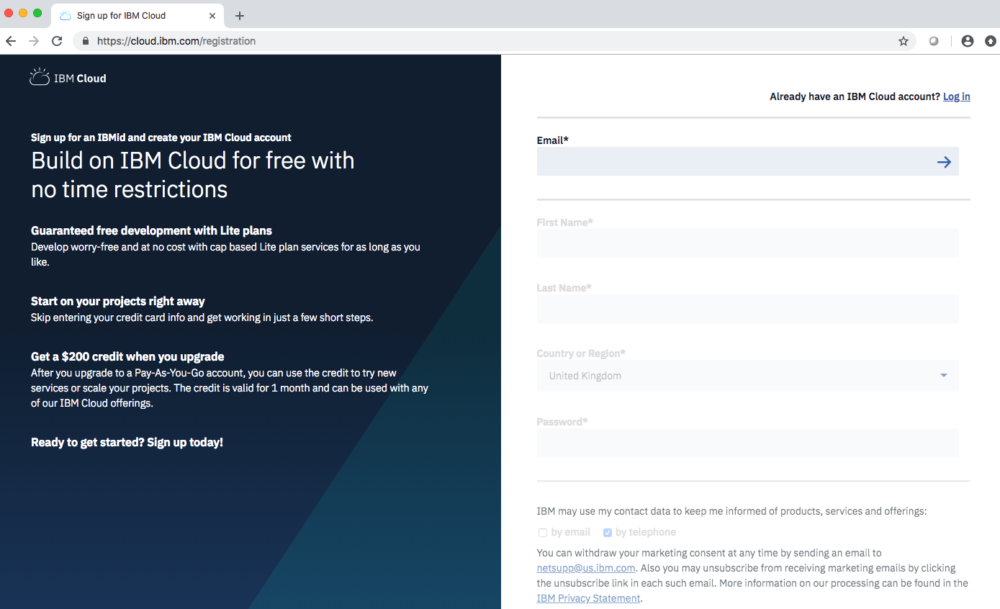


# Steps

1. Cloud Foundry and Catalog Overview
2. Create your application using a starter kit
3. Work locally
4. Deploy again and navigate on your dashboard
5. Using the IBM Cloud CLI
6. Challenge


# Step 1 - Cloud Foundry and Catalog Overview

IBM's innovative cloud computing platform combines platform as a service (PaaS) with infrastructure as a service (IaaS) and includes a catalog of cloud services that can be integrated with PaaS and IaaS to build business applications.

You can choose from bare metal servers to server-less compute to build the best solution for your workload

1. Connect to your [IBM Cloud account](https://cloud.ibm.com)

2. On the top left, click on the hamburger menu:

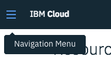

3. You can see different sections are available: Cloud Foundry, Kubernetes, Classic Infrastructure and VMware. In this lab, we will focus on the Cloud Foundry functionalities.

4. Click on "Cloud Foundry" to learn more.
With IBM Cloud Foundry, you don't need to manage servers or clusters. You can focus on your code and your data and directly deploy your application to IBM cloud. You can either use Public applications or Enterprise Environment (experimental).
Many application runtimes are managed on IBM Cloud: .Java liberty, .JS, .xsp, .swift, .py, .rb, .net, .php, .go, tomcat

5. In order to organise your workspace on IBM Cloud we are going to create a specific space for these hands-on. Click on "Manage your public organisations and spaces" under the "Public Applications" section:

	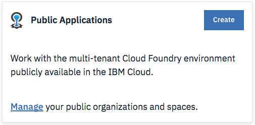

6. You may have already have a Cloud Foundry organisation created. If not, create one (click "add an organisation"). Then, select your organisation and "Add a space":

	

7. Chose the "US South" or "United Kingdom" region and give your space a name like "handsOn" for example. Click Save.

	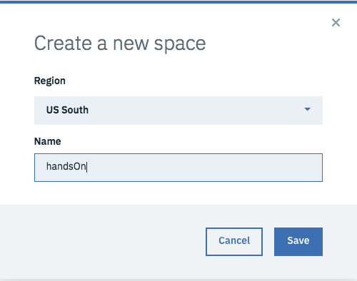

	You now have a dedicated space where you will run and deploy your Cloud Foundry applications today.

8. You now are going to browse the catalog to discover services and APIs available on IBM Cloud. You will use some of them in the following hands-On labs.
Click on the "Catalog" tab on the top menu:

	

	On the left side, there is a shortcut menu to access the different category of services and APIs. For example if you scroll to the "AI" category, you can instantiate the different IBM Watson APIs and tools to add cognitive features to your applications:

	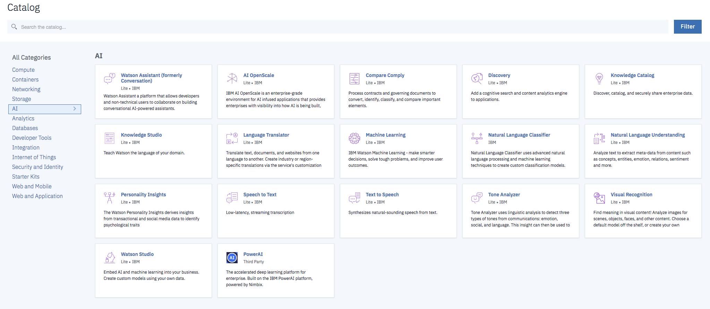

	If you look at the "Databases" section, you find out different type of database are available on IBM Cloud: SQL or noSQL, IBM products or Third party products ...

	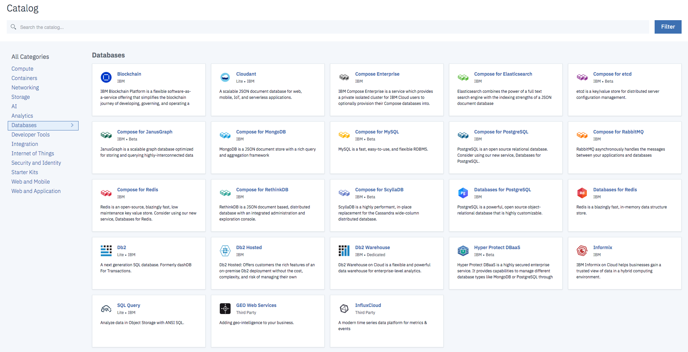

# Step 2 - Create your application using a starter kit

In IBM Cloud, you can build enterprise-level mobile and web applications and take advantage of cloud extensions that are hosted by IBM Cloud. You can use the IBM Cloud console and command line tools to build, run, and deploy your apps. Get started in two ways: create an app with a starter kit that manages the process for you, or if you know what you want, build your app with the resources you need.

You can use a starter kit to quickly get your app started and prepare it for future development. Choose a starter kit and programming language, create an app, and then set up a DevOps toolchain to automatically deploy your app. You can also download the code for immediate inspection.

1. From the catalog section, browse the "Starter Kits" category:

	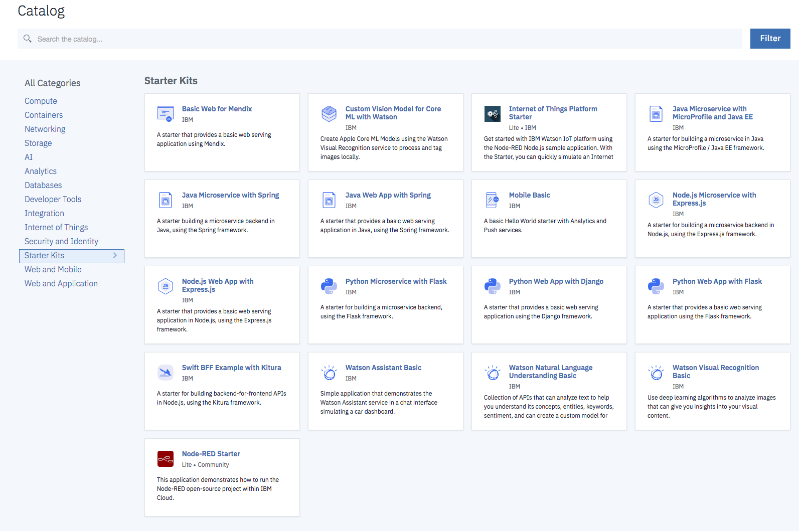

1. Select the "Node.js Web App with Express.js". This starter kit comes pre-configured as a Web App with Express.js , using the Node.js runtime.

1. Click on "Create app":

	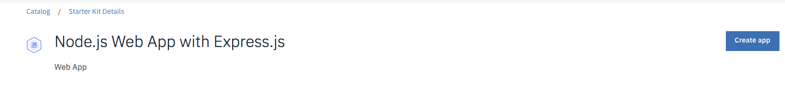

1. Give to your app a unique name (e.g. nodeapp-[your-initials]) or leave the default name.
You can leave the Resource group as default. Click Create.

1. Add a new resource to your application before deploying it. This way you can add a service to your app and some configuration files will be automatically generated. Click on "Add resource":
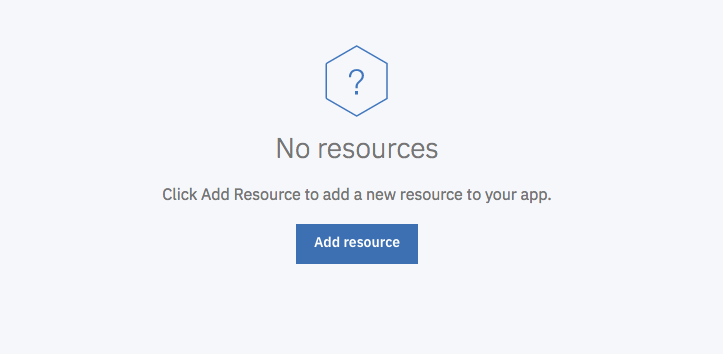

1. Select the Data category and click Next:
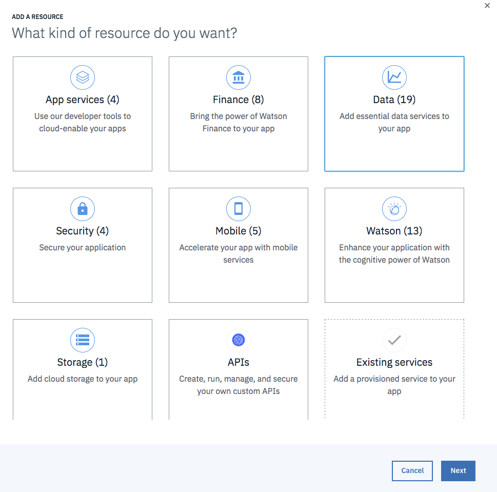

1. Chose an instance of a Cloudant database:

	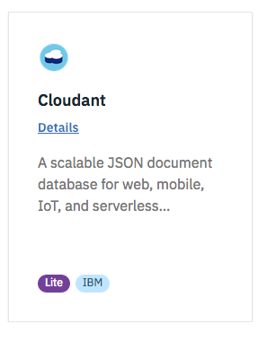

	The Cloudant DB will be created in the chosen region (chose the same than where you have created your space), leave the resource group as default and click Create.

1. You are now going to deploy your app to the Cloud using the toolchain. Click on "Deploy to Cloud":
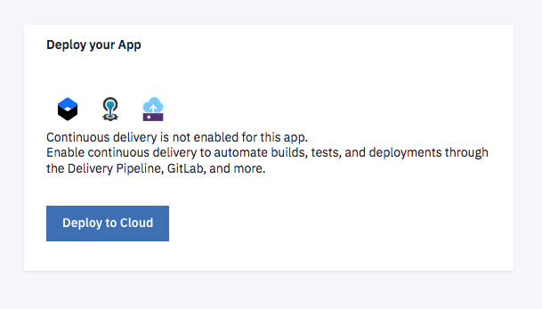

1. Chose "Deploy to Cloud Foundry" and configure the deployment to make sure the app will be deployed in the region/space you have created earlier. Click Next:
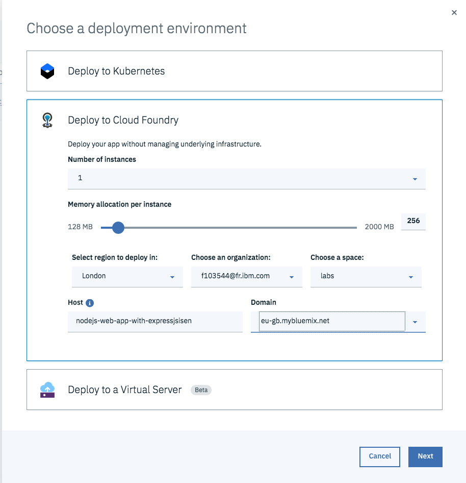

1. Configure the Toolchain the same way. Click Create:
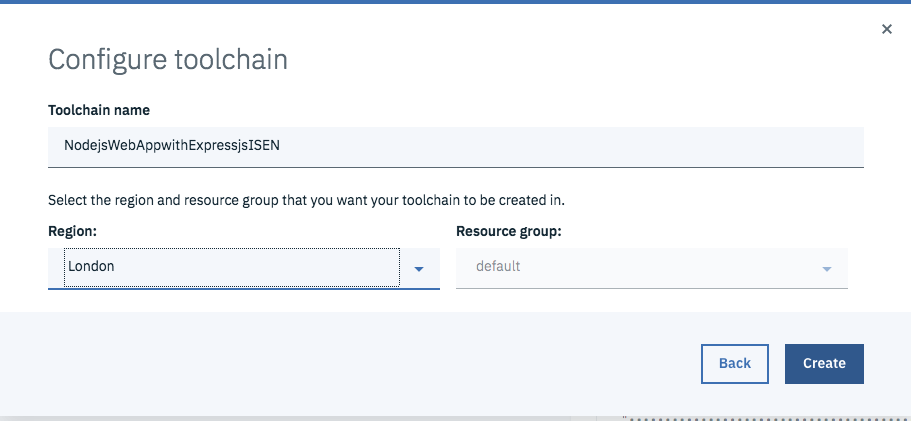

1. When deployed, your app is accessible at https://[yourappname].[domain]
Depending the region you have selected:
    - Dallas - mybluemix.com
    - Washington - us-east.mybluemix.net
    - Frankfurt - eu-de.mybluemix.net
    - London - eu-gb.mybluemix.net
	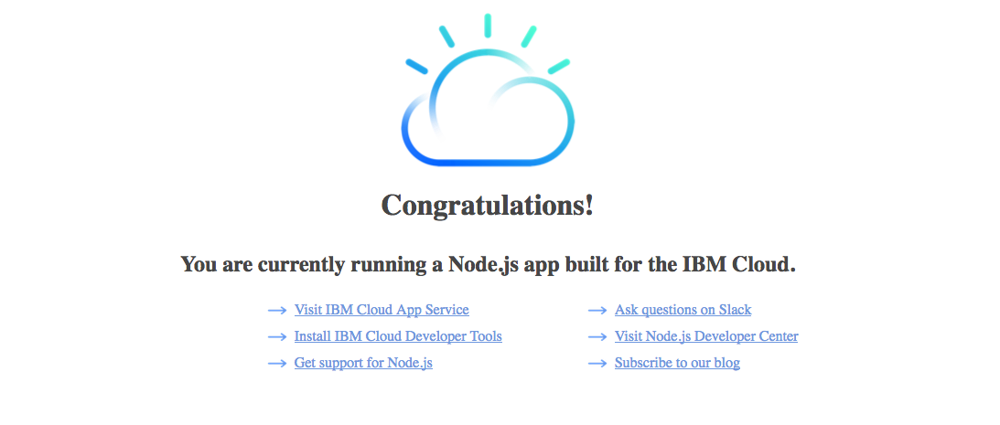

1. Click on the Git URL to access your Git repository:
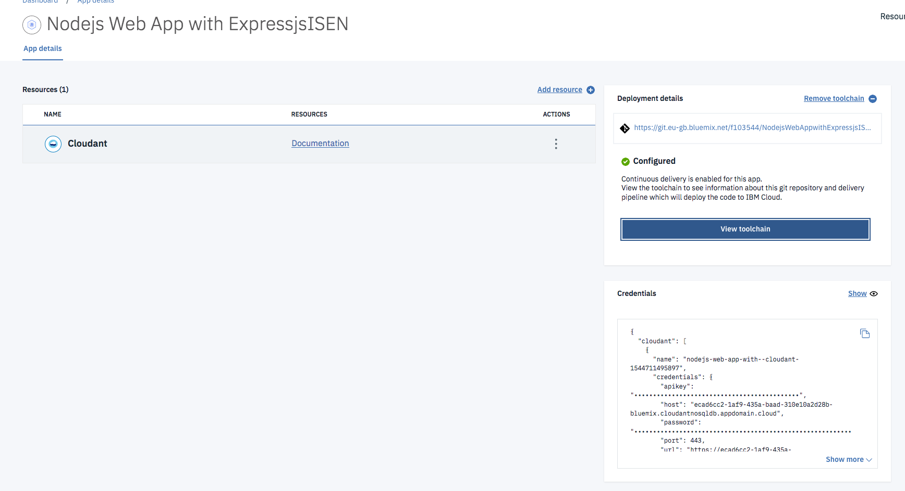
You can access the Git repository integrated withe the IBM Cloud toolchain.
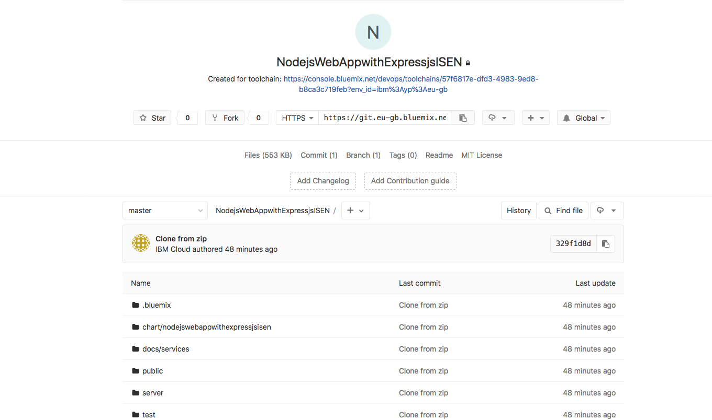

# Step 3 - Work locally

In the previous step you deployed on the cloud a first version of your application and you configure a toolchain associated to your app that created a Git repository for you.
In this part, you will clone this repo locally and work locally from your laptop.
Open a terminal and locate in a folder where you want your source locally.


1. Clone the source code with Git:
	```
	git clone [your git url]
	```
	You may need your username which is your IBM Cloud id and a password: you can generate a personal access token on your account to access your code from the command line.

	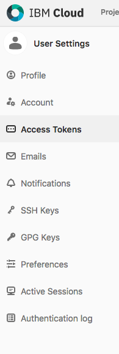

1. Go into your source code folder:
```
cd [your_foldername]
```

1. Install the npm dependencies:
```
npm install
```

1. Create a local file in the server folder, name it "localdev-config.json". Add the following code and fill out your database credentials in apikey, host, password, url and username.
These information can be found on the dashboard of your application on IBM Cloud.
```
{
  "cloudant_apikey": "",
  "cloudant_host": "",
  "cloudant_iam_apikey_description": "Auto generated apikey during resource-key operation for Instance",
  "cloudant_iam_apikey_name": "auto-generated-apikey",
  "cloudant_iam_role_crn": "crn:v1:bluemix:public:iam::::serviceRole:Manager",
  "cloudant_iam_serviceid_crn": "crn:v1:bluemix:public:iam-identity",
  "cloudant_password": "",
  "cloudant_port": 443,
  "cloudant_url": "",
  "cloudant_username": ""
}
```
	This file stays locally and is not handled by Git.
1. Start your app:
```
npm start
```
1. Open a tab in your browser at: http://localhost:3000

	Your app is running locally.

	1. Open a tab in your browser at: http://localhost:3000/appmetrics-dash

		These are your application metrics.

1. Open a new tab to visualise your Database: [your_cloudant_url]/dashboard.html

	Chose "Sign in with IBMid"

	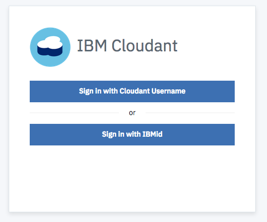

	No database are created yet.

	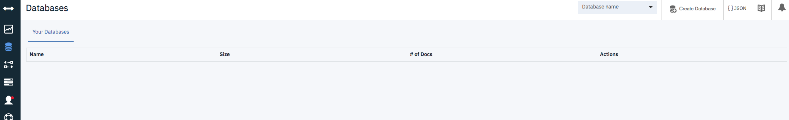

1. Stop your app (ctrl+c)

1. Edit the server.js file in a code editor and add the following code to initiate your Cloudant database when your app starts:

```
// Add your code here
const cloudant = serviceManager.get('cloudant');
var mydb;


if(cloudant) {
  //database name
  var dbName = 'mydb';

  // Create a new "mydb" database.
  cloudant.db.create(dbName, function(err, data) {
    if(!err) //err if database doesn't already exists
      console.log("Created database: " + dbName);
  });

  // Specify the database we are going to use (mydb)...
  mydb = cloudant.db.use(dbName);
}

```
1. Start your app again and make sure a db "mydb" is created:
```
npm start
```
Check the logs in the console and also refresh your Cloudant tab to see your db.
	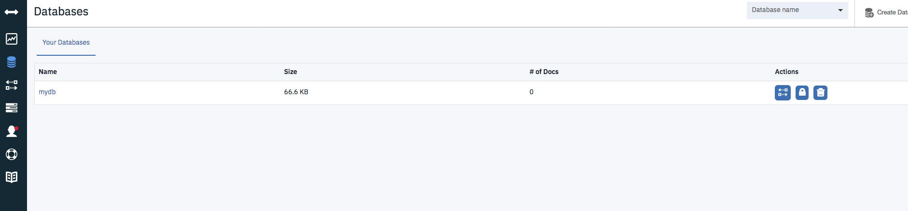

1. You are now going to update the UI, edit the public/index.html file and modify it as you like. Save it. Refresh.

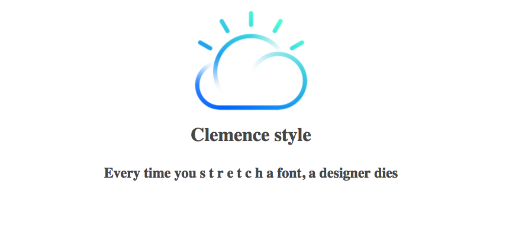

1. Stop your app.

# Step 4 - Deploy again and navigate on your dashboard

1. Commit and push your changes to Git
```
git commit -m "your commit message"
git push
```

As you are using the Toolchains, your app will be automatically re-built and re-deployed.

1. On IBM Cloud Click on the "View Toolchain" Button
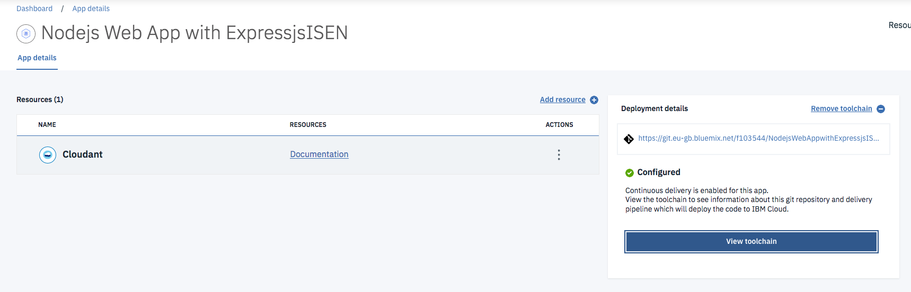

1. It opens the toolchains for you, select the delivery pipeline
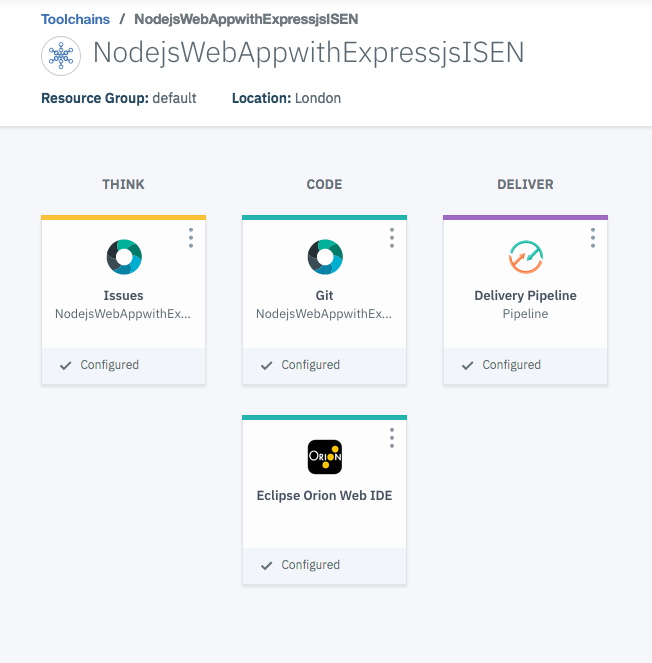

1. Wait for your application to be deployed
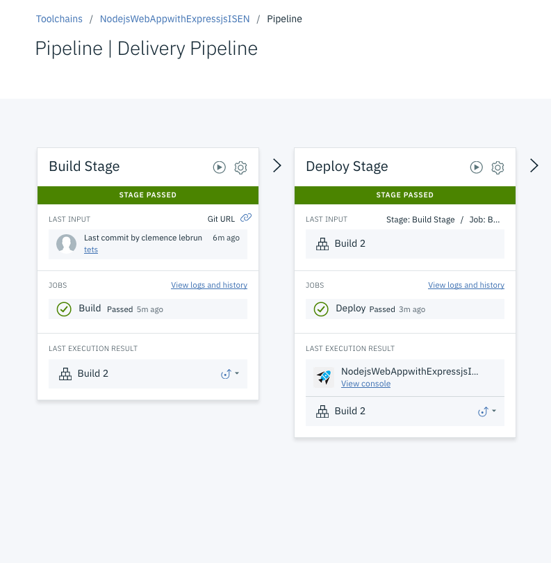

1.	Click on View Console to open your app dashboard:

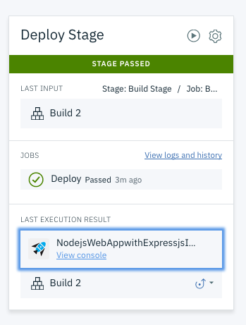

1.	Your dashboard :

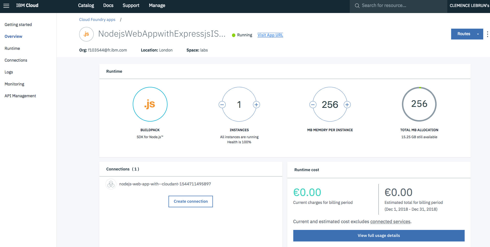

# Step 5 - Using the IBM Cloud CLI


1. Connect to IBM Cloud from the CLI:
```
ibmcloud login
```
1. Target an IBM Cloud api endpoint depending the region you are working from:
```
ibmcloud target --cf-api ENDPOINT -o ORG -s SPACE
```

	- ENDPOINT: api.eu-gb.bluemix.net (UK) or api.ng.bluemix.net (US)
	- ORG: your email used to Login
	- SPACE: the name of the space created

1. List your apps in your space:
```
ibmcloud cf apps
```
You may have only the one you deployed earlier

1. List your services in your space:
```
ibmcloud cf services
```
You may have only the cloudant instance

1. With the CLI, you can also push your app directly to ibm cloud. Let's create a new app. Change of directory.
```
cd..
```
1. Clone an hello world app
```
git clone https://github.com/cllebrun/starters.git
```
```
cd starters/NodeJSStarter
```
1. Install and start the app locally
```
npm install
```
```
npm start
```
1. Stop your app

1. Edit the manifest.yml with a unique name and host (take the same name), for example "your-initials-labs-ibm-isen".

	If you are using the UK region, edit also the domain "eu-gb.mybluemix.net"

	Save it.

1. Push your app to IBM Cloud and wait for your app to start
```
ibmcloud cf push
```
1. Launch your app in your browser

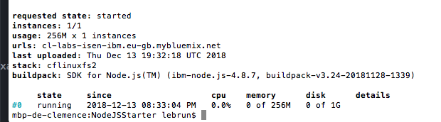

1. List your apps in your space:
```
ibmcloud cf apps
	```
	Two apps are now in your space.

1. Delete this app with the CLI:
```
ibmcloud cf delete APP_NAME
```

1. List your apps in your space:
```
ibmcloud cf apps
```
	Only one of the app is left.

# Step 6 - Challenge

Work on your first app. Make a major change to your app, for example:

- Make a post from the front end to populate the database

Commit and push your code to deploy your app !
