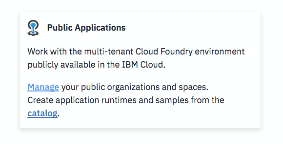
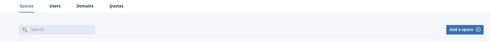

# Introduction

This lab is an introduction to IBM Cloud and its posibilities. No need any developer skills to complete the lab. You just need an IBM Cloud account in order to create your web application.  

# Objective

+ Organize your IBM Cloud account workspace
+ Discover the IBM Cloud services catalog
+ Use one of the starter kits available to create your web application on IBM Cloud
+ Manage your IBM Cloud Dashboard

# Pre-Requisites

+ Get an [IBM Cloud Platform account](https://console.bluemix.net/registration/), or use an existing account.

# Steps

1. Cloud Foundry and Catalog Overview
2. Create your application using a starter kit
3. Navigate on your dashboard

# Step 1 - Cloud Foundry and Catalog Overview

IBM's innovative cloud computing platform combines platform as a service (PaaS) with infrastructure as a service (IaaS) and includes a catalog of cloud services that can be integrated with PaaS and IaaS to build business applications.

You can choose from bare metal servers to serverless compute to build the best solution for your workload

1. Connect to your [IBM Cloud account](https://console.bluemix.net) 

2. On the top left, click on the hamburger menu: 

3. You can see different sections are available: Cloud Foundry, Containers, Infrasctructure and VMware. In this lab, we will focus on the Cloud Foundry functionalities. 

4. Click on "Cloud Foundry" to learn more.
With IBM Cloud Foundry, you don't need to manage servers or clusters. You can focus on your code and your data and directly deploy your application to IBM cloud. You can either use Public applications or Entreprise Environment (experimental)

Many application runtimes are managed on IBM Cloud: .Java liberty, .JS, .xsp, .swift, .py, .rb, .net, .php, .go, tomcat

5. In order to organize your workspace on IBM Cloud we are going to create a specific space for these hands-on. Click on "Manage your public organizations and spaces" under the "Public Applications" section:

6. You may have already have a Cloud Foundry organization created. If not, create one (click "add an organization"). Then, select your organization and "Add a space":

  
7. Chose the "US South" region and give your space a name like "handsOn" for example. Click Save.

You now have a dedicated space where you will run and deploy your Cloud Foundry applications today.

8. You now are going to browse the catalog to discover services and APIs available on IBM Cloud. You will use some of them in the following hands-On labs.
Click on the "Catalog" tab on the top menu: 

On the left side, there is a shorcut menu to access the different category of services and APIs. For example if you scroll to the "AI" category, you can instanciate the different IBM APIs and tools

# Step 2 - Create your application using a starter kit

In IBM Cloud, you can build enterprise-level mobile and web applications and take advantage of cloud extensions that are hosted by IBM Cloud. You can use the IBM Cloud console and command line tools to build, run, and deploy your apps. Get started in two ways: create an app with a starter kit that manages the process for you, or if you know what you want, build your app with the resources you need.

You can use a starter kit to quickly get your app started and prepare it for future development. Choose a starter kit and programming language, create an app, and then set up a DevOps toolchain to automatically deploy your app. You can also download the code for immediate inspection.

1. 

1. 

 
1. 

1. 

# Step 3 - Navigate on your dashboard

1. 

 
  
1. 
1. 
1.  

# Resources

For additional resources pay close attention to the following:

