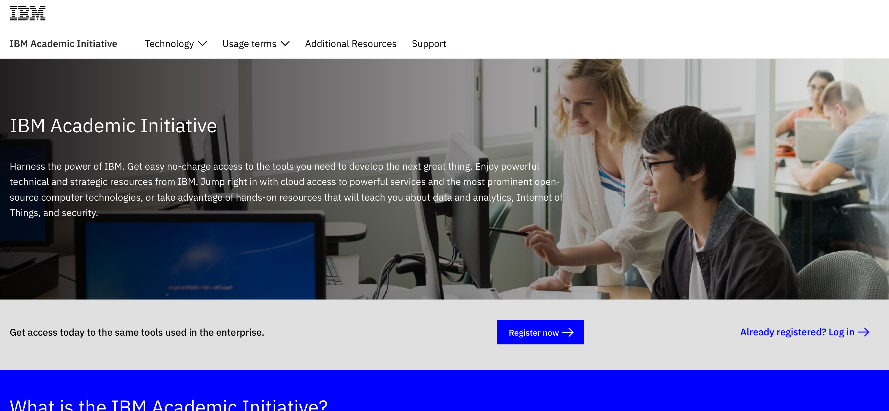
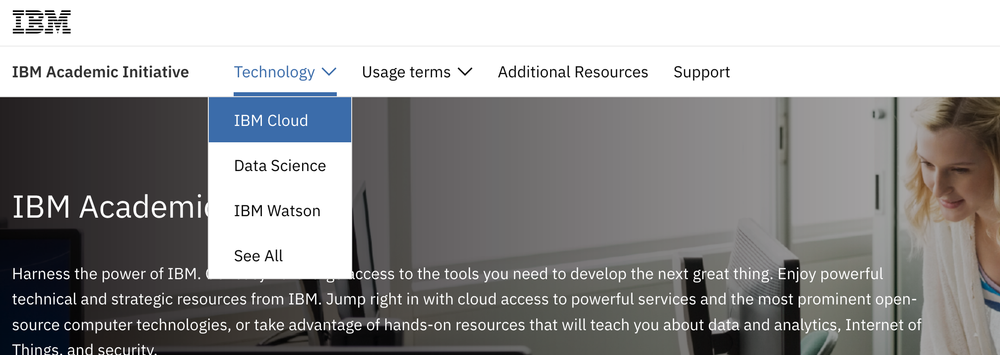
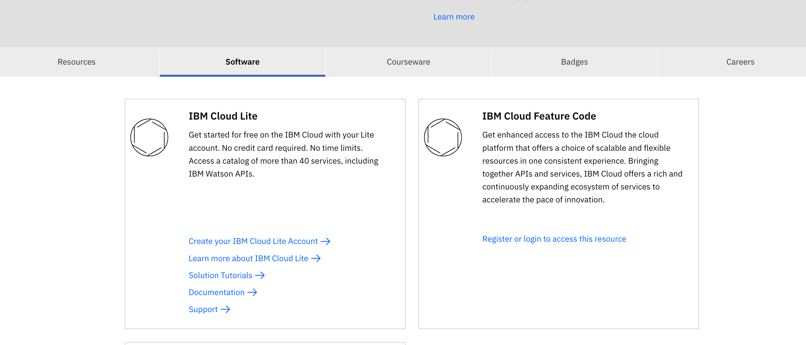
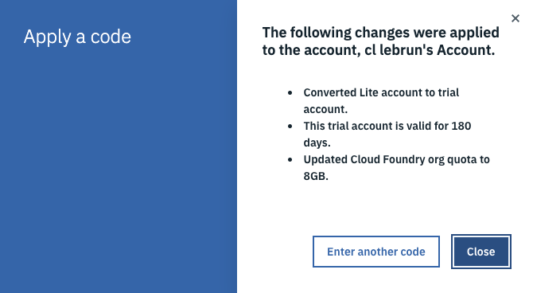

# 1 - Create an IBM Cloud account in the US region

+ Create an [IBM Cloud account](https://cloud.ibm.com/registration/standard2
) in the **US region**. You need an email address.

+ Look at your emails and confirm the registration

# 2 - Optional: if you are a student and want to register to the IBM Academic Program

As a student, if you want to benefit from the IBM Academic Program and get IBM Cloud free credits to extand your existing account (increase your memory allocation up to 2 GB),
you can subscribe to the program.

> **Note:** What are the details about the no-charge extended cloud-access offer for educators and students?

> IBM is offering faculty and students the opportunity to access services/service levels which may not otherwise be available though the free, no time limit, public cloud Lite plan. Those who qualify for and apply an academic code to their IBM Cloud account will convert their account type from Lite to Trial.

> Trial account users are entitled to access the free service levels ($Free Plan) for each IBM Cloud service. Please note that accounts which are converted from Lite to Trial will be expired at the end of the trial/promotional period if a new code is not applied which extends the account. Trial accounts do not require credit card information.

> Student codes will set the users account type to Trial for up to six months, ending June 30 and December 31 of a calendar year (renewable) AND increase the memory allocation up to 2 GB.

+ Create an academic account (using the same email address than you used to create your IBM Cloud account = your IBM ID) on the: [IBM Academic Initiative page](ibm.biz/academic)

Click on **Register Now**

Login. You can now generate your IBM Cloud Promocode

+ On the menu, select on **Technology->IBM Cloud**

+ Scroll down and select the **Software** tab and click on the link to generate your promocode on the **IBM Cloud Feature Code** tile:

+ Save this promocode and apply it to your IBM Cloud account (part 3)

# 3 - Optional: if you want to apply a promocode to your IBM Cloud account

You can apply a promocode you have got for example with the IBM academic initiative or by an IBMer at a specific event (hackathon, workshop...)

+ Convert your **Lite** account to a **Trial** account:

Once you applied your code, you get access to more resources on IBM Cloud!

Your Trial account is valid for about 3-6 months (depending on your code type).

