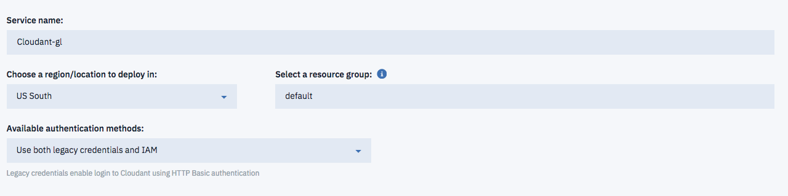

# Introduction

By following this tutorial, you'll set up a development environment, deploy an app locally and on IBM Cloud, and integrate an IBM Cloud database service in your app.


# Objective

In the following lab, you will learn:

+ How to develop locally and deploy to the cloud
+ How to create and bind a new service 
+ How to use the IBM Cloud Command Line Interface


# Pre-Requisites

+ Get an [IBM Cloud Platform account](https://console.bluemix.net/registration/), or use an existing account.
+ Install the [IBM Cloud developer tools](https://github.com/IBM-Cloud/ibm-cloud-developer-tools) (this includes IBM Cloud CLI)
+ Install the [Git CLI](https://git-scm.com/downloads)
+ Install [Node.js](https://nodejs.org) to test your app locally


# Steps

1. [Clone the sample app](#step-1---clone-the-sample-app)
2. [Run the node.js app locally](#step-2---run-the-node.js-app-locally)
3. [Prepare for the deployment](#step-3---prepare-for-the-deployment)
4. [Deploy the app](#step-4---deploy-the-app)
5. [Add a database](#step-5---add-a-database)
6. [Use the database](#step-6---use-the-database)


# Step 1 - Clone the sample app

1. On your laptop, create a folder for the hands-On labs. 
2. On the command line, change the directory to where this folder is located
3. Clone the sample app source code from git: 

  ```
  $ git clone https://github.com/IBM-Cloud/get-started-node

  ```

# Step 2 - Run the node.js app locally

1. Change the directory to where the sample app is loacted:
  
  ```
  $ cd get-started-node
  ```

1. Install the dependencies listed in the package.json file to run the app locally.

  ```
  $ npm install
  ```

1. Run the app

  ```
  $ npm start
  ```

  The console output will look like:
  
  ```
  ...
  > node server.js
  
  To view your app, open this link in your browser: http://localhost:3000
  ```

1. Access the app with your web browser to vizualise your local node.js app

# Step 3 - Prepare for the deployment

To deploy to IBM Cloud, it can be helpful to set up a manifest.yml file. The manifest.yml includes basic information about your app, such as the name, how much memory to allocate for each instance and the route. We've provided a sample manifest.yml file in the get-started-node directory.

  ```
  applications:
  - name: GetStartedNode
    random-route: true
    memory: 128M
  ```
  In this manifest.yml file, random-route: true generates a random route for your app to prevent your route from colliding with others. 

1.  Replace random-route: true with host: myChosenHostName, supplying a host name of your choice.

# Step 4 - Deploy the app

1.  Log in to your IBM Cloud account, and select an API endpoint. If you created a specific space for theses hands-on labs in the US south region for example, provide the US South API endpoint:

  ```
  ibmcloud api  https://api.ng.bluemix.net
  ```

  ```
  ibmcloud login
  ```
1.  If it is asked, provide your account.
1.  Target a Cloud Foundry org and space:
  
  ```
  ibmcloud target --cf
  ```
1. Choose the space you have created for these hands-On labs or pick the one of your choice.
1. From within the get-started-node directory, push your app to IBM Cloud.

  ```
  ibmcloud cf push
  ```

  Deploying your application can take a few minutes. When deployment completes, you'll see a message that your app is running. View your app at the URL listed in the output of the push command, or view both the app deployment status and the URL by running the following command:
  ```
  ibmcloud cf apps
  ```

# Step 5 - Add a database

Next, we'll add an IBM Cloudant NoSQL database to this application and set up the application so that it can run locally and on IBM Cloud.

1. In your browser, log in to IBM Cloud and go to the Dashboard. Select Create Resource.

1. Choose the Databases section, then select Cloudant and create your service (same space where you havec pushed your application).

  

1. Go to the Connections view and select your application, then Create connection. Connect and Restage app.

1. Select Restage when prompted. IBM Cloud will restart your application and provide the database credentials to your application using the VCAP_SERVICES environment variable. This environment variable is available to the application only when it is running on IBM Cloud.

  Tips: Environment variables enable you to separate deployment settings from your source code. For example, instead of hardcoding a database password, you can store this in an environment variable which you reference in your source code.

# Step 6 - Use the database

We're now going to update your local code to point to this database. We'll create a JSON file that will store the credentials for the services the application will use. This file will get used ONLY when the application is running locally. When running in IBM Cloud, the credentials will be read from the VCAP_SERVICES environment variable.

1.  In the get-started-node directory, create a file called vcap-local.json with the following content:

  ```
  {
    "services": {
      "cloudantNoSQLDB": [
        {
          "credentials": {
            "url":"CLOUDANT_DATABASE_URL"
          },
          "label": "cloudantNoSQLDB"
        }
      ]
    }
  }
  ```
1.  In your browser, go to the IBM Cloud dashboard and select your app > Connections. Click the IBM Cloudant menu icon (⋮) and select View credentials.

1.  Copy and paste just the url from the credentials to the url field of the vcap-local.json file, replacing CLOUDANT_DATABASE_URL.

1.  Run your application locally.
  
  ```
  $ npm start
  ```
  View your local app at http://localhost:3000. Any names you enter into the app will now get added to the database.


Avoid trouble: IBM Cloud defines the PORT environment variable when your app runs on the cloud. When you run your app locally, the PORT variable is not defined, so 3000 is used as the port number. See Run your app locally for more information.

Your local app and the IBM Cloud app are sharing the database. Names you add from either app will appear in both when you refresh the browsers.


# Resources

For additional resources pay close attention to the following:

- [Cloudant documentation](https://console.ng.bluemix.net/docs/services/Cloudant/index.html#getting-started-with-cloudant)