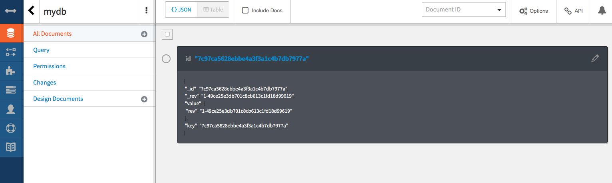

# 1.2 Lab Node.js - add a Watson service - Introduction

# Getting started with Node.js and Cloudant on the IBM Cloud Platform
By following this guide, you'll set up a development environment, deploy an app locally and on the IBM Cloud Platform, and integrate a database service in your app.

<p align="center">
  
</p>


# Objective

In the following lab, you will learn:

+ How to deploy a new Cloud Foundry app based on Node.js runtime
+ How to run a Node.js app locally
+ How to create a new database service  
+ How to use the Cloud Foundry Command Line Interface


# Pre-Requisites

+ Get an [IBM Cloud Platform account](https://console.bluemix.net/registration/), or use an existing account.
+ Install the [IBM Cloud CLI](http://clis.ng.bluemix.net/ui/home.html)
+ Install the [Git CLI](https://git-scm.com/downloads)
+ Install [Node.js](https://nodejs.org) to test locally


# Steps

1. [Clone a sample application](#step-1---clone-a-sample-application)
2. [Run the app locally](#step-2---run-the-app-locally)
3. [Prepare the app for deployment](#step-3---prepare-the-app-for-deployment)
4. [Deploy the app](#step-4---deploy-the-app)
5. [Add a database](#step-5---add-a-database)
6. [Use the database](#step-6---use-the-database)


# Step 1 - Clone a sample application

Now you're ready to start working with the simple Node.js *hello world* app. Clone the repository and change to the directory to where the sample app is located.
  ```
  git clone https://github.com/IBM-Bluemix/get-started-node
  ```

  ```
  cd get-started-node
  ```

# Step 2 - Run the app locally

Install the dependencies listed in the [package.json](https://docs.npmjs.com/files/package.json) file to run the app locally.  
  ```
  npm install
  ```

Run the app.
  ```
  npm start  
  ```

View your app at: http://localhost:3000

# Step 3 - Prepare the app for deployment

To deploy to the IBM Cloud Platform, it can be helpful to set up a manifest.yml file. One is provided for you with the sample. Take a moment to look at it.

The manifest.yml includes basic information about your app, such as the name, how much memory to allocate for each instance and the route. In this manifest.yml **random-route: true** generates a random route for your app to prevent your route from colliding with others.  Replace 'nodejs-helloworld' with the name of your choice for your application. You can also replace **random-route: true** with **host: myChosenHostName**, supplying a host name of your choice but it has to be unique. [Learn more...](https://console.bluemix.net/docs/manageapps/depapps.html#appmanifest)
 ```
 applications:
 - name: nodejs-helloworld
   random-route: true
   memory: 128M
 ```

# Step 4 - Deploy the app

You can use the the IBM Cloud Platform CLI to deploy apps.


1. Chose the *API-endpoint* in the command with an API endpoint from the following list.

  * US SOUTH: https://api.ng.bluemix.net
  * US EAST: https://api.us-east.bluemix.net
  * UK: https://api.eu-gb.bluemix.net
  * GERMANY: https://api.eu-de.bluemix.net
  * SYDNEY: https://api.au-syd.bluemix.net
   
  ```
   bx api <API-endpoint>
  ```

1. Login to your Bluemix account

  ```
  bx login
  ```
1. Target the right org and space on the IBM Cloud Platform

  ```
  $  bx target -o [your_org_name] -s [your_space_name]
  ```


1. From within the *nodejs-helloworld* directory push your app to Bluemix
  ```
  bx app push
  ```

This can take a minute. If there is an error in the deployment process you can use the command `bx cf logs <Your-App-Name> --recent` to troubleshoot.


1. View your app at the URL listed in the output of the push command, for example, *myUrl.mybluemix.net*.  You can issue the
```
bx apps
```
command to view your apps status and see the URL.


# Step 5 - Add a database

Next, we'll add a NoSQL database to this application and set up the application so that it can run locally and on the IBM Cloud Platform.
You can do it using the IBM Cloud UI or the CLI:

1. Using the CLI:

1. the Watson TTS service could have been provionned by running the command line, give it a name like "cloudantNoSQLDB-node":

```
  $ bx cf create-service cloudantNoSQLDB lite [your_service_name]

```

1. Bind the Watson service to your app:

```
  $ bx cf bind-service [your_app_name] [your_service_name]

```
1. Restage your app:

```
  $ bx cf restage [your_app_name]

```

1. Get your VCAP_SERVICES:

  Your application will restart and the service connection information will be made available to your application.

  ```
  bx cf env <your_app_name>

  ```
and you'll find the credentials under: 

"VCAP_SERVICES": {
  "cloudantNoSQLDB": [
   {
    "credentials": { ...


1: Using the UI:

1. Log in to the IBM Cloud Platform in your Browser. From the Catalog section, create the `Cloudant NoSQL DB` int the same region/org/space than you already have your app.
2. From your app overview, click 'Create Connection' under the 'Connections' section, chose the Cloudant instance you've just created.
3. Select `Restage` when prompted. Bluemix will restart your application and provide the database credentials to your application using the `VCAP_SERVICES` environment variable. This environment variable is only available to the application when it is running on the IBM Cloud Platform.

# Step 6 - Use the database

We're now going to update your local code to point to this database. We'll create a json file that will store the credentials for the services the application will use. This file will get used ONLY when the application is running locally. When running in the IBM Cloud Platform, the credentials will be read from the VCAP_SERVICES environment variable.

1. Create a file called `vcap-local.json` in your app directory with the following content:
  ```
  {
    "services": {
      "cloudantNoSQLDB": [
        {
          "credentials": {
            "url":"CLOUDANT_DATABASE_URL"
          },
          "label": "cloudantNoSQLDB"
        }
      ]
    }
  }
  ```

2. Back in the Bluthe IBM Cloud Platformemix UI, select your App -> Connections -> Cloudant -> View Credentials

3. Copy and paste just the `url` from the credentials to the `url` field of the `vcap-local.json` file.

4. Run your application locally.
  ```
  npm start  
  ```

  View your app at: http://localhost:3000. Any names you enter into the app will now get added to the database.


5. Re-deploy to the IBM Cloud Platform!
  ```
  bx app push
  ```

  From the the IBM Cloud Platform UI in your browser your can access your Database UI and check the names in your database:
  Select your App -> Connections -> Cloudant logo -> Launch -> mydb

  

  Look at the server.js file, this is where are implemented the get and post method to store and retrieve data in the cloudant database.


  # Step 3 - Change a file locally

1. In your file directory, open and edit **views/index.html** using a code editor such as Sublime or Notepad++

1. Remove the text (l19-20) and add a Text Area and a Button on the UI:

1. Remove:

  ```
  <h1 id="message">Hello World!</h1>
  <p class='description'></p> Thanks for creating a <span class = "blue">NodeJS Starter Application</span>.
  ```
1. Replace by:

  ```
  <textarea rows="4" cols="50" class="textbox">
    Hello Watson !
  </textarea>
  <button type="button" class="speech-btn">Make me speak !</button> 
  <audio type="audio/ogg" preload="none" class="audio">audio element not supported !</audio>

  ```
1. Reload the page in your web browser to confirm the change locally

# Step 4 - Push your local app to the cloud

Cloud Foundry relies on the *manifest.yml* file to know what to do when you run the *cf push* command.
Replace with your app name (deployed on the IBM Cloud Platform) for both "name" and "host"

  ```
  applications:
  - path: .
    memory: 256M
    instances: 1
    domain: mybluemix.net
    name: <yourappname>
    host: <yourappname>
    disk_quota: 1024M
  ```

It basically defines one application taking its content from the current directory,
being deployed with **256MB**, with **one** instance, under the **mybluemix.net** domain.
The app is named **yourappname** and it is using **yourappname** as host name.
It has **1024MB** of disk space available.

1. Connect to the IBM Cloud Platform

  ```
  $ bx api <endpoint>
  ```

  Select one of the API endpoint below to target the region in which you earlier have created your app using the IBM Cloud UI (Step 1). 
  * US SOUTH: https://api.ng.bluemix.net
  * US EAST: https://api.us-east.bluemix.net
  * UK: https://api.eu-gb.bluemix.net
  * GERMANY: https://api.eu-de.bluemix.net
  * SYDNEY: https://api.au-syd.bluemix.net

  Pushing an app with the same name and host, targeting the same region, org and space in which your existing hoseted app is, that will be erased and replaced.
  
1. Connect to the IBM Cloud Platform

  ```
  $ bx api <endpoint>
  ```
  
1. Login to the IBM Cloud Platform

  ```
  $ bx login
  ```
1. Target the right org and space on the IBM Cloud Platform

  ```
  $  bx target -o [your_org_name] -s [your_space_name]
  ```

1. Push the app to the IBM Cloud Platform

  ```
  $ bx app push
  ```

1. When the command completes, access the application running in the cloud to confirm your change was deployed

  ```
  requested state: started
  instances: 1/1
  usage: 256M x 1 instances
  urls: nodeapp-[your-initials].eu-gb.mybluemix.net
  last uploaded: Thu Mar 14 15:24:17 UTC 2016
  stack: cflinuxfs2
  buildpack: SDK for Node.js(TM) (ibm-node.js-4.3.0, buildpack-v3.1-20160222-1123)

       state     since                    cpu    memory          disk          details   
  #0   running   2016-03-14 04:25:24 PM   0.0%   75.9M of 256M   92.5M of 1G      
  ```

Changing files locally and pushing them worked but we can do better.
In a previous step we set up a Git repository and a build pipeline was automatically configured.


# Step 5 - Create and bind a Watson service

To give more value to your app, you are now going to add a Text To Speech service

1. the Watson TTS service could have been provionned by running the command line, give it a name like "nodeapp-tts":

```
  $ bx cf create-service text_to_speech lite [your_service_name]

```

1. Bind the Watson service to your app:

```
  $ bx cf bind-service [your_app_name] [your_service_name]

```
1. Restage your app:

```
  $ bx cf restage [your_app_name]

```

  Your application will restart and the service connection information will be made available to your application.


# Step 6 - Use the Watson service in your app

When your application runs in Cloud Foundry, all service information bound to the application are available in the **VCAP_SERVICES** variable.

1. Update your manifest file, to make your app recognizing the binding service you have created. Add your service name at the end:

  ```
  services:
    - [your-service name]
  ```

1. Install the cfenv and watson node modules:

  ```
  npm install watson-developer-cloud --save

  ```
  ```
  npm install cfenv --save

  ```

1. In your local directory, open the app.js server side js file and add: 

  ```
  var  watson = require('watson-developer-cloud');
  var cfenv = require('cfenv');
  
  var tts_service_vcap = appEnv.services["text_to_speech"];

  if (tts_service_vcap){
    var tts_credentials = tts_service_vcap[0].credentials;
    var textToSpeech = watson.text_to_speech({
      version: 'v1',
      username: tts_credentials.username,
      password: tts_credentials.password
    });

  }
  else{ 
    // (If you nedd to do local development, replace username and password)
    var textToSpeech = watson.text_to_speech({
      version: 'v1',
      username: '<username>', // provide username from service credentials
      password: '<password>' // provide password from service credentials
    });
  }

  // Handle text to speech request from client
  app.get('/api/synthesize', function(req, res, next) {
    var transcript = textToSpeech.synthesize(req.query);
    transcript.on('response', function(response) {
      if (req.query.download) {
        response.headers['content-disposition'] = 'attachment; filename=transcript.ogg';
      }
    });
    transcript.on('error', function(error) {
      next(error);
    });
    transcript.pipe(res);
  });
  ```

1. Replace <username> and <password> by your credentials, you can run the CF command:
  ```
  bx cf env <your_app_name>

  ```
and you'll find username and password under: 

"VCAP_SERVICES": {
  "text_to_speech": [
   {
    "credentials": { ...

Note that you also have the possibility to find the credentials using the IBM Cloud UI, under your application Runtime menu -> Environment variables.

1. In your app directory, locally, create a .js file in your public folder, name it "index.js"

1. Edit the file "index.js" to add the logic to call the Watson text to speech service when you click on the button in your app web interface:

  ```
  // ****** Code snippet for index.js ***/
  /** Handle the button by invoking server side code to convert the text
  * describing personality into speech
  * Replaces periods in text with blanks as periods are converted to
  * the word "dot"
  * and blanks are ignored
  */
  $('.speech-btn').click(function(){
    console.log('listen pressed');
    var theText = $('.textbox').val();
    theText = theText.replace(/\./g,' ');
    console.log(theText);
    var streamingURL = '/api/synthesize?text='+ encodeURIComponent(theText);
    var audio = $('.audio').get(0);
    audio.src = streamingURL;
    audio.play();
    return false;
  });
  ```
1. In your index.html file, call the .js file and the ajax library by adding these two lines after the closing body HTML tag:

  ```
    <script type= "text/javascript" src="https://ajax.googleapis.com/ajax/libs/jquery/1.11.1/jquery.min.js"></script>
    <script src="index.js"></script>
  ```
1. Test your app locally:

  
  ```
  $ npm start
  ```

  The console output will look like:
  
  ```
  > NodejsStarterApp@0.0.1 start /Users/john/dev/[your_app_name]
  > node app.js
  
  server starting on http://localhost:[port-number]
  ```

1. Access the app with your web browser (turn on the volume and click on the speak button)

1. If it is working well you can now push it to the IBM Cloud Platform ! (you can remove hardcoded username and password)


  # Resources

For additional resources pay close attention to the following:

- [Cloudant documentation](https://console.ng.bluemix.net/docs/services/Cloudant/index.html#getting-started-with-cloudant)

