# 3.0 Lab Watson - Introduction to IBM Natural Language Classifier

# Objective

This tutorial will teach you how to build a customer service department routing service using IBM's Natural Language Classifier service which uses machine learning to figure out which department a customer's email/text/chat/phone call should be routed to. This service learns by examples that you provide and then when new questions are posed by customers, the system figures out which department is most appropriate for the question -- even if it has never seen the question before. This is the power of artificial intelligence algorithms as used in the Natural Language Classifier.

# Pre-Requisites

+ an [IBM Cloud Platform account](https://cllebrun.github.io/labs/0_Registration/)

# Steps
[Create the service on the IBM Cloud](#create-the-service-on-the-ibm-cloud)

[Training the service](#training-the-service)

[Test the classifier](#test-the-classifier)

[Conclusion](#conclusion)

# Create the service on the IBM Cloud

1.  Navigate to the [IBM Cloud](https://www.ibm.com/cloud/).

2.  Log in to the IBM Cloud.

3.  On the IBM Cloud dashboard, select Catalog from the menu bar.

4.  Enter Natural Language Classifier in Search the catalog

5.  Click on Natural Language Classifier.

> 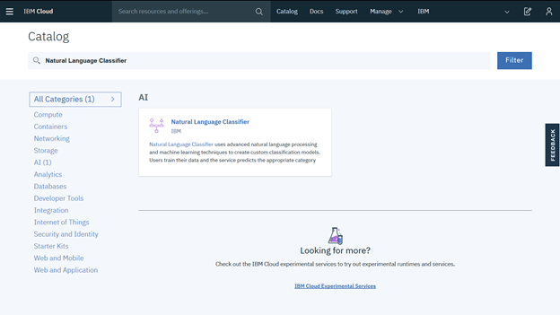

6.  The defaults are fine, so just click on Create.

7.  Go back to the Catalog and enter Watson Studio in Search the catalog.

8.  Click on Watson Studio.

    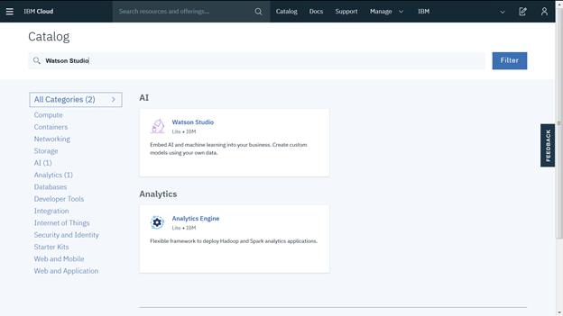

9.  The defaults are fine, so just click the **Create** button.

10. Next click on the Get Started button.

11. On the Watson Studio Welcome screen, click on Create a project.

    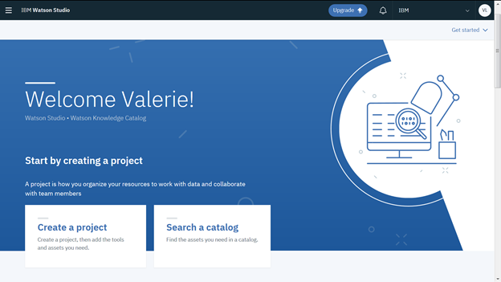

12. Select a Standard project.

    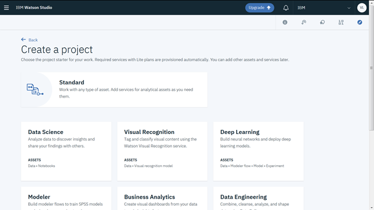

13. Give a name for the project, ensure that you have selected a Cloud Object Storage (if not already created, you will need to create it) and click on Create.

    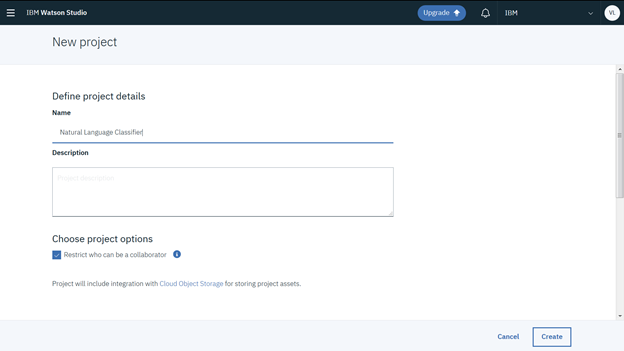

14. On the project Overview page click on Add to project.

15. Select the Natural Language Classifier asset.

> 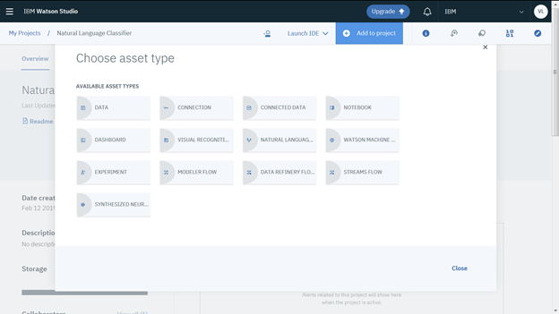

16. You get to the following screen where you need to associate a Watson Natural Language Classifier service by clicking on here.

> 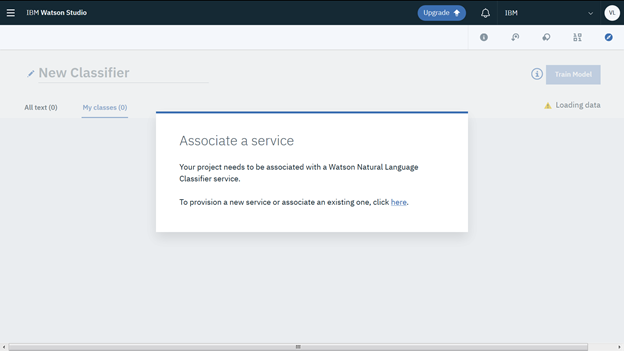

17. Select the Natural Language Classifier service that you created in the list and click on Select.

> 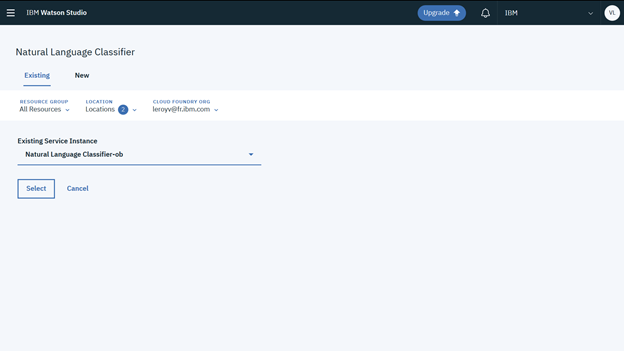

18. You should get to the following screen:

    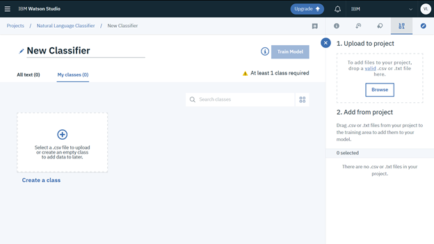

# Training the service

The natural language classifier service is trained by providing examples of natural language text and a classifier (i.e. a type or classification of the text) -- the more examples you provide, the better the accuracy. In a real life scenario, it is best to have multiple test users (ideally real users like from past forums or customer questions) provide training data -- this ensures a less biased AI system.

1.  Before importing the training data, let's take a look at what the training data looks like.

2.  Download the **NLC\_import\_data**.**csv** file from the box folder.

3.  Open the **NLC\_import\_data**.**csv** file with Excel or a text editor.

    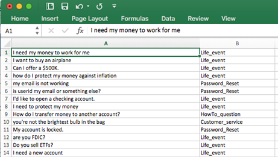

-   Note the training data is simply a set of questions in one column and the classification of that question in another column - simple comma-separated-text file.

-   Feel free to modify this file to something else like your kind of business.

-   You can also use the toolkit to enter the questions and classification, but it is often faster in Excel.

4.  Click on Browse to add the csv file to the project.

    

5.  Select the **NLC\_import\_data.csv.**

6.  The **NLC\_import\_data.csv** is now available to train the model.

    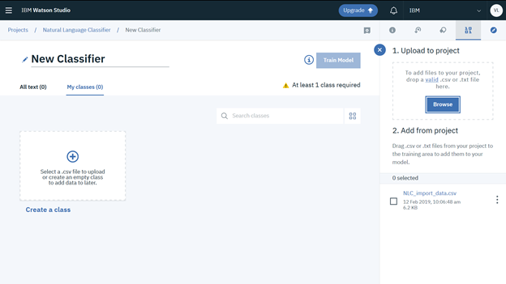

7.  Select it and click on Add to model.

    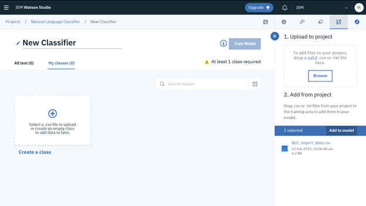

8.  You should get to the following screen. Four new classes have been created for the model : Customer\_service, HowTo\_question, Life\_event and Password\_Reset.

    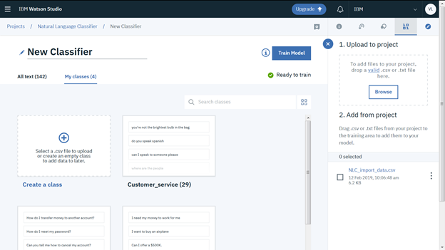

9.  You can view the examples of a class by clicking on the class.

10. If necessary you can add a new example by entering text and clicking on Add example.

    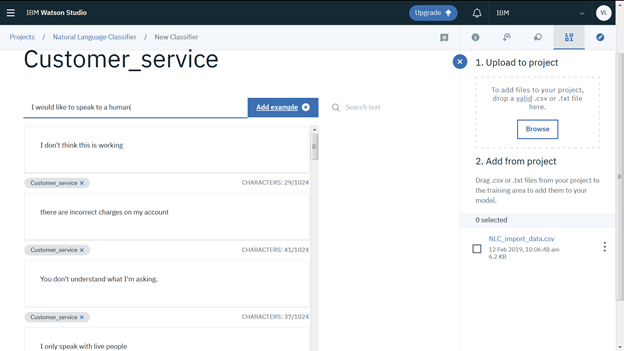

11. Go back to the model by clicking on View all classes.

    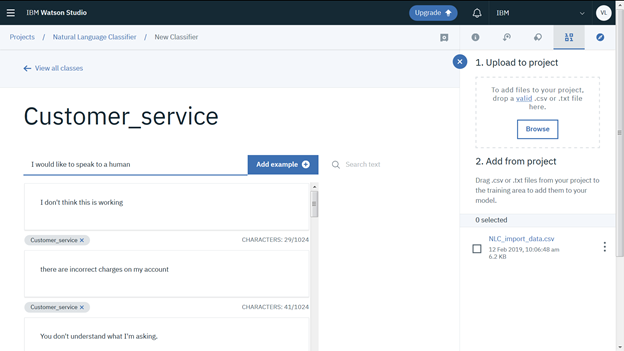

12. We are now ready to train the model. Click on Train Model.

13. Specify the English language for the model language and click on Train.

    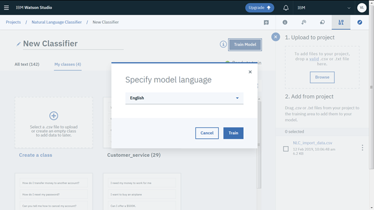

14. At the end of the training process, you get a Training successful message and the status is now Trained.

15. Click on here to view and test the model.

    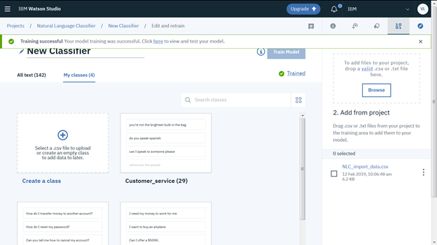

# Test the classifier

Now that Watson has been trained on your specific terminology, let's test it.

1.  On the Overview you get information on the trained model. Click on Test to test it.

    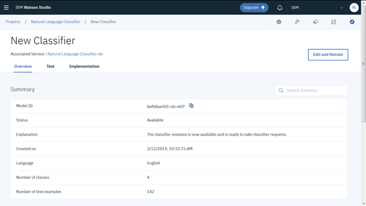

2.  Enter an example question that a banking customer might ask their bank (e.g. I'd like to procure a new home.) and click on Classify.

    

-   Note: if you search the training set (e.g. in Excel), you'll note that the word "procure" is not in the training set, yet the model understands that "procure" in this context is similar to "purchase". It is correctly classified by the service as a Life\_event.

    

3.  Try another example like: Can you help me purchase a new boat?

    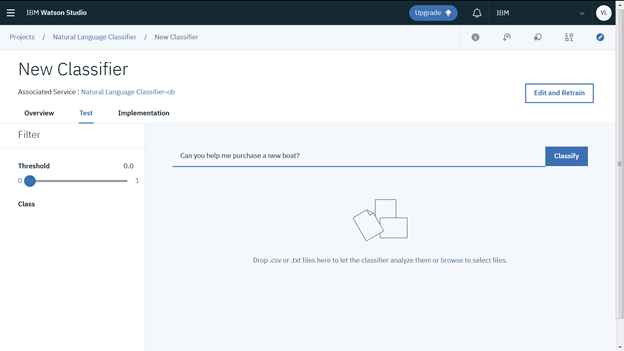

-   Again, that sentence is not in the training data, yet sentences similar are and so the model can predict that this question is similar enough to the examples it has been trained on. It is this power that far exceeds what "keyword" matching can do, which is why this sort of automation has been too difficult in the past -- until now!

    

4.  Let's try another example: Are you Skynet?

    

-   Notice in this example, the confidence level isn't that high -- this is an important point with adopting AI systems: they can't do everything and may not be 100% correct all the time (much like humans), so when the AI isn't that certain, then route this request to a human. AI isn't going to replace people, but rather reduce the repetitive tasks.

    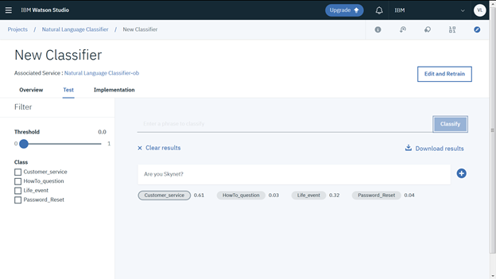

-   Feel free to experiment with other examples.

5.  Click on Implementation.

6.  You will find here examples on how to call the Natural Language Classifier model that you just created.

    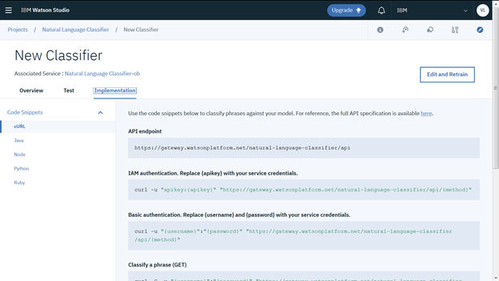

# Conclusion

This lab demonstrated the power of cognitive computing using IBM's Natural Language Classifier Service. In just a few minutes, you were able to group customer questions into "buckets" that could be used for routing calls to the appropriate department. This also demonstrates a very easy and tactical way to begin your Cognitive adoption -- start with something small and specific and grow your AI capabilities over time.
