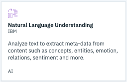
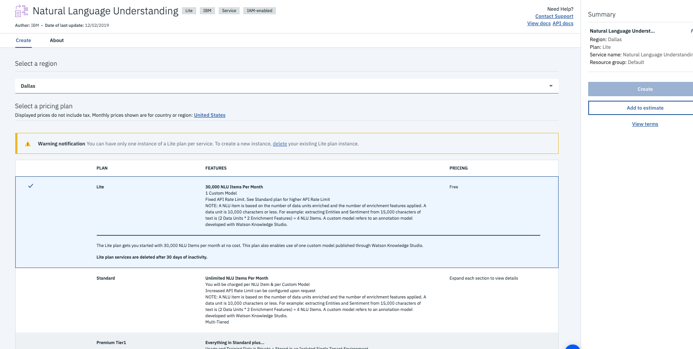

# 3.1 Lab Watson - Introduction to IBM Natural Language Understanding

With Natural Language Understanding, developers can analyze semantic features of text input, including categories, concepts, emotion, entities, keywords, metadata, relations, semantic roles, and sentiment.


In this lab, you go through a step-by-step process to learn how to use it.


# Objective

In the following lab, you will learn:


+ Test NLU using curl
+ Integrate NLU


# Pre-Requisites

+ Get an [IBM Cloud Platform account](https://console.bluemix.net/registration/), or use an existing account.


# Steps

1. Create the service
2. API call using curl
3. Analyze target phrases and keywords


# Step 1 - Call the API using curl

1. On the IBM Cloud Platform account dashboard, select **Catalog** from the menu bar.

1. Look for the **Natural Language Understanding** service. Click on the service tile.

  

1. Choose the Dallas region, the Lite plan and click **Create**. The service instance is created, and the service dashboard page opens automatically.

  


# Step 2 - API call using cURL

On the main page of your service, in the **Manage** tab, you have access to an API Key and a URL. These are required to call the API.

You can send requests to the API with text, HTML, or a public URL, and specify one or more of the following features to analyze:

  - **Concepts**:
Identify high-level concepts that aren't necessarily directly referenced in the text.

  - **Emotion**:
Analyze emotion conveyed by specific target phrases or by the document as a whole. You can also enable emotion analysis for entities and keywords that are automatically detected by the service.

  - **Entities**:
Find people, places, events, and other types of entities mentioned in your content. View the complete list of entity types and subtypes here.

  - **Keywords**:
Search your content for relevant keywords.

  - **Metadata**:
For HTML and URL input, get the author of the webpage, the page title, and the publication date.

  - **Relations**:
Recognize when two entities are related, and identify the type of relation.

  - **Semantic Roles**:
Parse sentences into subject-action-object form, and identify entities and keywords that are subjects or objects of an action.

  - **Sentiment**:
Analyze the sentiment toward specific target phrases and the sentiment of the document as a whole. You can also get sentiment information for detected entities and keywords by enabling the sentiment option for those features.


1.  Open a text editor and prepare the following command:

  ```
  curl -X POST -u "apikey:{apikey}" \
  "{url}/v1/analyze?version=2019-07-12" \
  --header "Content-Type: application/json" \
  --data '{
    "url": "http://newsroom.ibm.com/Guerbet-and-IBM-Watson-Health-Announce-Strategic-Partnership-for-Artificial-Intelligence-in-Medical-Imaging-Liver",
    "features": {
      "sentiment": {},
      "categories": {},
      "concepts": {},
      "entities": {},
      "keywords": {}
    }
  }'

  ```

1. Replace {apikey} and {url} with your service credentials (on the service Manage tab)

1. Open a terminal and run the command to analyze a webpage to get sentiment, concepts, categories, entities, and keywords.


# Step 3 - Analyze target phrases and keywords

Natural Language Understanding can analyze target phrases in context of the surrounding text for focused sentiment and emotion results. The targets option for sentiment in the following example tells the service to search for the targets "apples", "oranges", and "broccoli". Since "apples" and "oranges" are located in the text, sentiment scores are returned for those targets.

You can also get sentiment and emotion results for entities and keywords that are detected in your text. In the example, the emotion option for keywords tells the service to analyze each detected keyword for emotion results.

```
curl -X POST -u "apikey:{apikey}" \
"{url}/v1/analyze?version=2019-07-12" \
--request POST \
--header "Content-Type: application/json" \
--data '{
  "text": "I love apples! I hate oranges. Brocoli are ok",
  "features": {
    "sentiment": {
      "targets": [
        "apples",
        "oranges",
        "broccoli"
      ]
    },
    "keywords": {
      "emotion": true
    }
  }
}'

```

Note that With IBM Watson Knowledge Studio, you can extend Natural Language Understanding with custom models that identify custom entities, relations, and categories unique to your domain.

# Resources

For additional resources pay close attention to the following:

- [Watson Assistant Documentation](https://console.bluemix.net/docs/services/assistant/getting-started.html#getting-started)

- [API reference](https://cloud.ibm.com/apidocs/natural-language-understanding/natural-language-understanding?_ga=2.150567798.1595110995.1575383823-679962596.1538488997&cm_mc_uid=66302025876115544728192&cm_mc_sid_50200000=22044011575383822411&cm_mc_sid_52640000=51483141575383822413)
