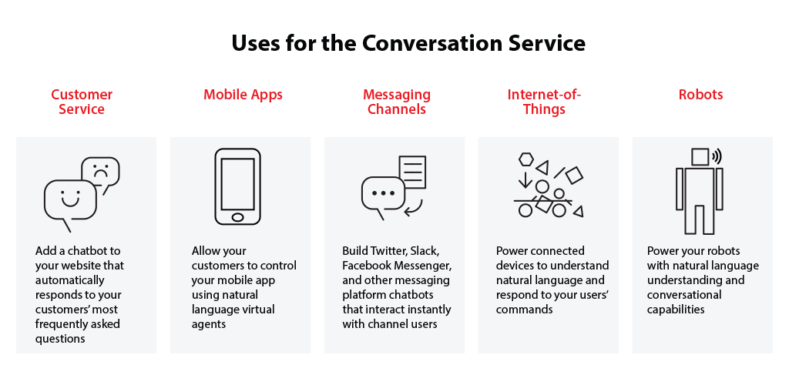
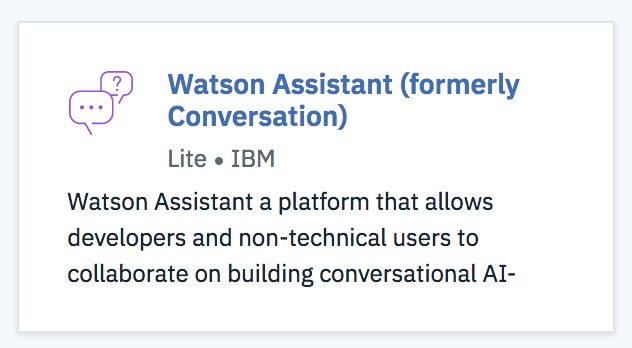
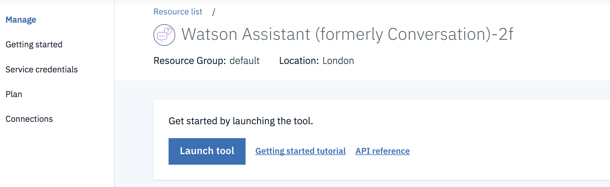
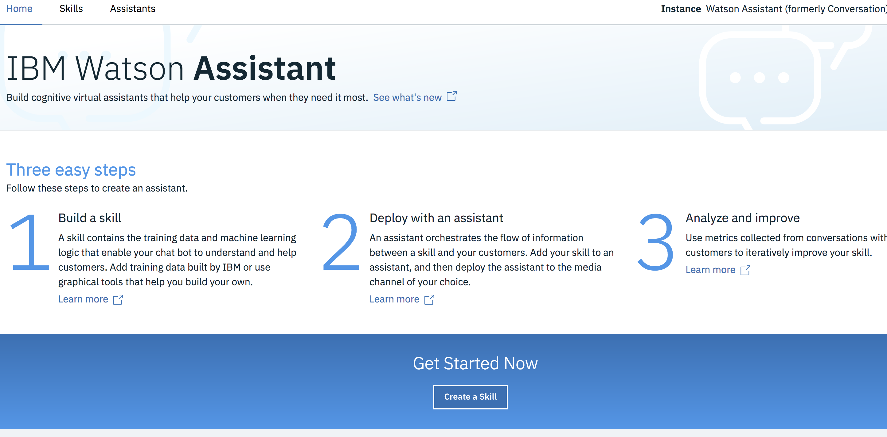
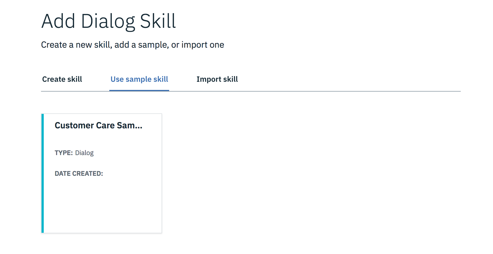
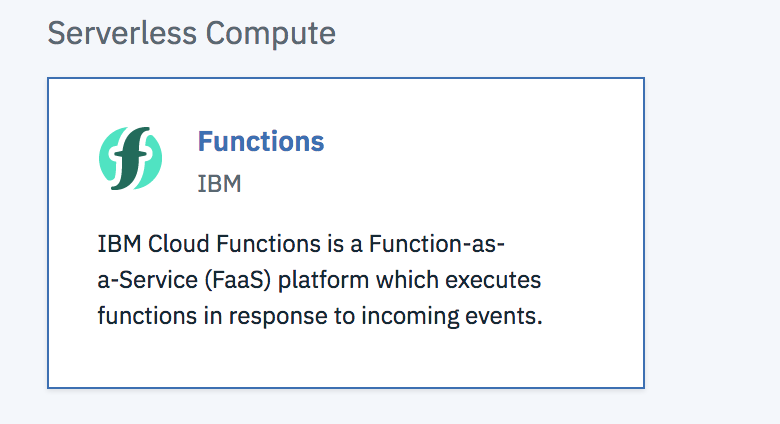
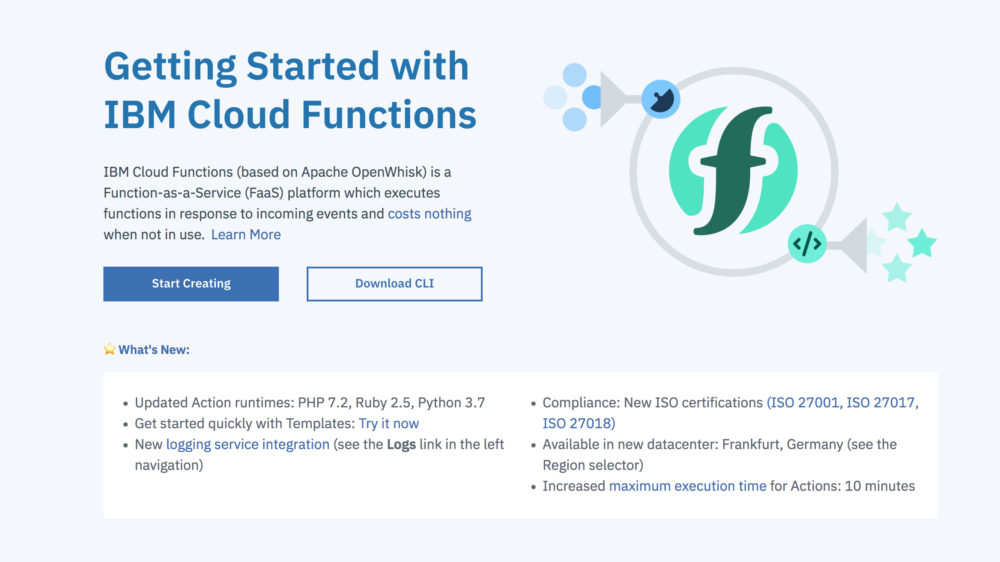
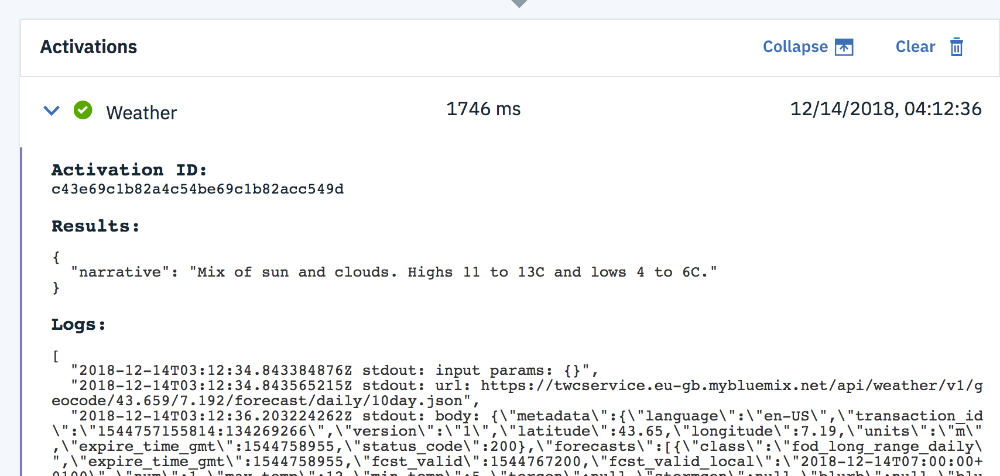
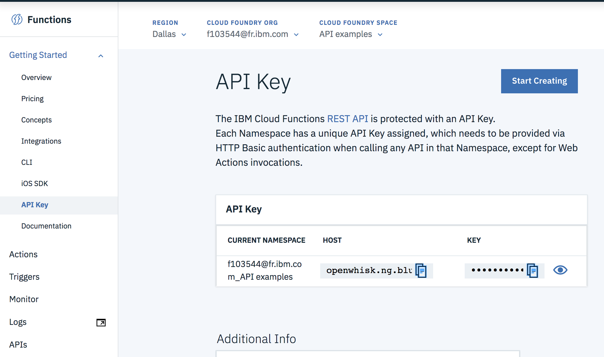

# 3.1 Lab Watson - Watson Assistant - Introduction

With the Watson Assistant service you can create virtual agents and bots that combine machine learning, natural language understanding, and integrated dialog tools to provide automated customer engagements.

The following image illustrates many uses for the Assistant service.

  

In this lab, you go through a step-by-step process to create your first dialog flow thanks to the easy-to-use graphical environment.


# Objective

In the following lab, you will learn:

+ How to train Watson to understand your users' input with intents and examples
+ How to identify the terms that may vary in your users' input
+ How to create the responses to your user's questions: Dialog Builder
+ How to test and improve your dialog


# Pre-Requisites

+ Get an [IBM Cloud Platform account](https://console.bluemix.net/registration/), or use an existing account.


# Steps

1. [Create a Watson Assistant service](#step-1---create-a-watson-assistant-service)
2. [Create your workspace](#step-2---create-your-workspace)
3. [Work with intents and examples](#step-3---work-with-intents-and-examples)
4. [Work with entities](#step-4---work-with-entities)
5. [Create a dialog](#step-5---create-a-dialog)
6. [Integrate the dialog into a web app](#step-6---integrate-the-dialog-into-a-web-app)


# Step 1 - Create a Watson Assistant service

1. On the IBM Cloud Platform account dashboard, select Catalog from the menu bar.

1. Scroll down to the Services section and click the icon for the Watson Assistant service. The Add Service page opens.



1. Click Create. The service instance is created, and the service dashboard page opens automatically.

1. On the dashboard page, click Manage and  **Launch Tool** to get started.




# Step 2 - Build a skill

A skill contains the training data and machine learning logic that enable your chat bot to understand and help customers. Add training data built by IBM or use graphical tools that help you build your own.

1. On the Skill tab, click "Create Skill"


1. Add a dialog skill (use sample skill)


This customer care is prebuilt for you, you can browse entities, intents and dialog

1. In the Dialog tab, open the "try out panel" to test the chatbot. Not that it may need some time to train.

1. Test it.


# Step 3 - Improve using serverless

The objective of the section is to define actions that can make
programmatic calls to external applications or services and get back a result as part of the processing that occurs within a dialog turn.You  can  use  an  external  service  to  validate  information  that  you  collected  from  the
user orperform calculations or string manipulations on the input which are too complex
to be handled by using supported SpEL expressions and methods. Or you can interact
with an external web service to get information, such as an air traffic service to check
on a flight's expected arrival
time or a weather service to get a forecast. You can even
interact with an external application, such as a restaurant reservation site, to complete
a simple transaction on the user's behalf.
By today, you will add
a new to get
information about the weather forecast in Nice. We
limited the location in Nice for our lab, but you can get such
an
information for
any
city
around the world.

1.  On IBM Cloud deploy an instance of the service "Weather Company data" either using the graphic console or using the CF CLI.

1.  Open the services credentials (generate it if needed) and copy the username, password and host. You will need it later.

1.  You are now going to create the Function called by Watson Conversation.This Function will call the Weather company service.

1.  On the Catalog, select the Compute category and instantiate a Function:


1.  Click on Start Creating:


  Make sure to select the region used by your Watson Assistant.

1.  Click Create Action
1.  Enter Weather as name, keep Node.js 8, click Create:


1.  Copy paste the code bellow in your action:

```
// Licensed to the Apache Software Foundation (ASF) under one or more contributor
// license agreements; and to You under the Apache License, Version 2.0.

var request = require('request');

/**
 * Get hourly weather forecast for a lat/long from the Weather API service.
 *
 * Must specify one of zipCode or latitude/longitude.
 *
 * @param username The Weather service API account username.
 * @param username The Weather service API account password.
 * @param latitude Latitude of coordinate to get forecast.
 * @param longitude Longitude of coordinate to get forecast.
 * @param zipCode ZIP code of desired forecast.
 * @return The hourly forecast for the lat/long.
 */

function main(params) {
    console.log('input params:', params);
    var username = params.username || '<user name>';
    var password = params.password  || '<password>';
    var lat = params.latitude || '43.659';
    var lon = params.longitude ||  '7.192';
    var language = params.language || 'en-US';
    var units = params.units || 'm';
    var timePeriod = params.timePeriod || '10day';
    var host = params.host || '<host>';
    var url = 'https://' + host + '/api/weather/v1/geocode/' + lat + '/' + lon;
    var qs = {language: language, units: units};

    switch(timePeriod) {
        case '48hour':
            url += '/forecast/hourly/48hour.json';
            break;
        case 'current':
            url += '/observations.json';
            break;
        case 'timeseries':
            url += '/observations/timeseries.json';
            qs.hours = '23';
            break;
        case '3day':
            url += '/forecast/daily/3day.json';
            qs.hours = '23';
            break;
        default:
            url += '/forecast/daily/10day.json';
            break;
    }

    console.log('url:', url);

    var promise = new Promise(function(resolve, reject) {
        request({
            url: url,
            qs: qs,
            auth: {username: username, password: password},
            timeout: 30000
        }, function (error, response, body) {
            if (!error && response.statusCode === 200) {
                var j = JSON.parse(body);
                console.log('body:', body);
                console.log('j:', j.forecasts[0].narrative);
                var tmp = { narrative: j.forecasts[0].narrative};
                resolve(tmp);
             //   resolve(j);

            } else {
                console.log('error getting forecast');
                console.log('http status code:', (response || {}).statusCode);
                console.log('error:', error);
                console.log('body:', body);
                reject({
                    error: error,
                    response: response,
                    body: body
                });
            }
        });
    });

    return promise;
}
```

1.  Replace username, password and host with the values for the Weather service you saved earlier. Change the coordinates if you want. Save.

1.  To test your action, click 'invoke'


1.  You need now to get the function credentials. Expand the getting started menu and click API Key:


1. Copy the Key value (which is actually username:password) and also the current namespace.

1.  Go back to the Watson Assistant tool, select the Opening node in the dialog tab.

1. Edit the welcome, by clicking on the "..." menu and selection "open the json editor" on the right.

  Copy this part of th json under "Context" and fill it with your Function credentials:

  ```
  "private":{
      "mycredential":{
        "username":"",
        "password":""
      }
    }
    ```

# Resources

For additional resources pay close attention to the following:

- [Watson Assistant Documentation](http://www.ibm.com/watson/developercloud/doc/conversation/index.shtml)
