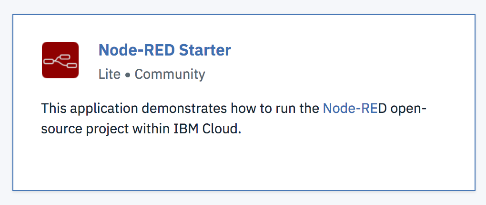
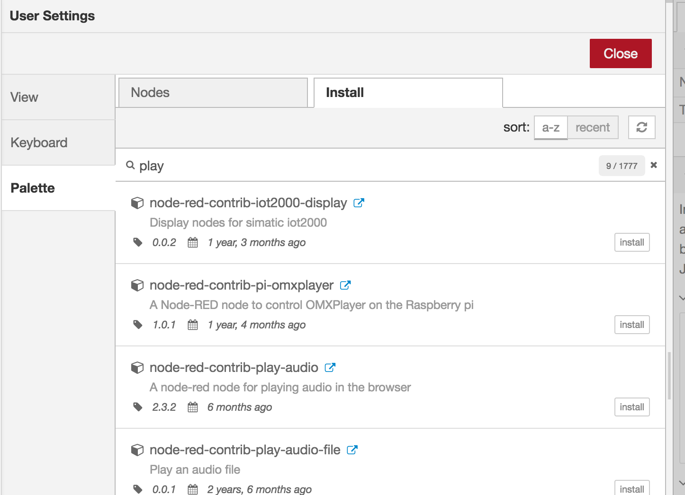
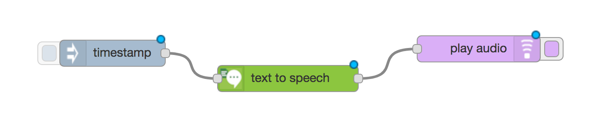
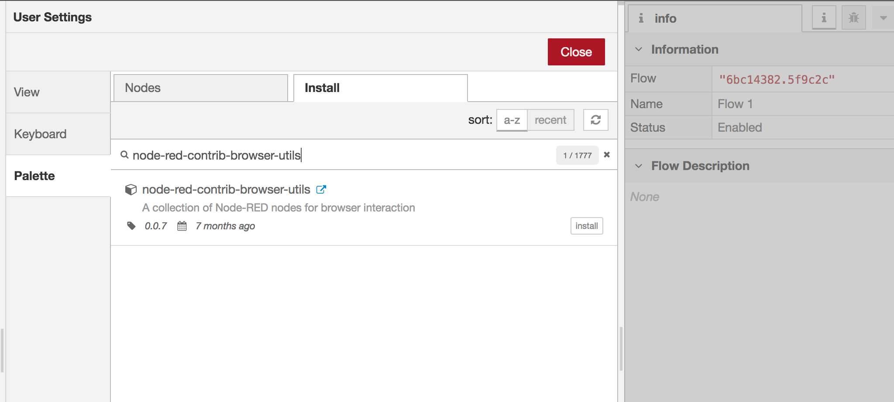
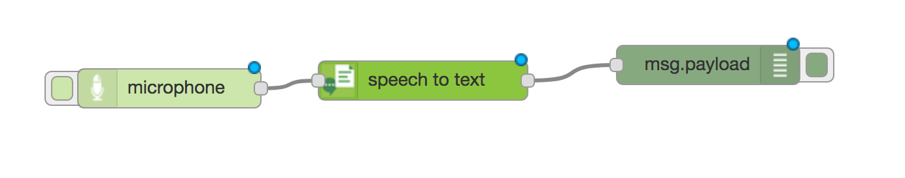

# 3.2 Lab Watson - Node-Red - OK Watson - Introduction

This hands-on, technically-oriented lab demonstrates the key capabilities of IBM Cloud Platform, Node-RED and Watson services. Attendees will first learn how to play with Node-RED and Watson services such as Text to Speech, Speech to Text, Conversation and Tone Analyzer. Then they will learn how to integrate Watson services in a web application with an interface using Node.js. This lab will give attendees a jump-start on each of these APIs.

# Objective

In the following lab, you will learn:

+ How to use Node-RED to develop quickly
+ How to use Watson services

# Pre-Requisites

+ Get an [IBM Cloud Platform account](https://console.bluemix.net/registration/), or use an existing account.

# Steps

1. Create a Node-RED instance
2. Watson Text To Speech
3. Watson Speech To Text
4. Watson Visual Recognition
5. Watson Tone Analyser

# Step 1 - Create a Node-RED instance

1.  Make sure to work in the same space during the lab. Chose the US-South region to work in.

1.  Browse the catalog on IBM Cloud and look for the "Node-RED Starter". Create it. It comes with an instance of Cloudant DB. Give it a unique name.

1.  Wait for your application to start and browse the URL.

1. Follow the instructions to secure your Node-RED application

# Step 2 - Watson Text To Speech

1.  Browse the catalog on IBM Cloud and look for the "Watson Text To speech". Create it.

1.  Bind it to your Node-RED app. Restage

1.  In your Node-RED app, Menu -> Manage Palette -> Install the "node-red-contrib-play-audio" package.

1.  Drag and drop the following nodes from the palette:

1.  Configure the inject node to send a string data: "Hello, how are you doing today ?"
1.  Configure the Watson node (language).

1.  Deploy with red button up and right. Trigger the inject node.

# Step 3 - Watson Speech To Text

1.  Browse the catalog on IBM Cloud and look for the "Watson Speech To Text". Create it.

1.  Bind it to your Node-RED app. Restage.

1.  In your Node-RED app, Menu -> Manage Palette -> Install the "node-red-contrib-browser-utils" package.

1.  Drag and drop the following nodes from the palette:

1.  Configure the Watson node (language).
1.  Deploy with red button up and right. Trigger the microphone and speak.
# Step 4 - Watson Visual Recognition
# Step 5 - Watson Tone Analyser
