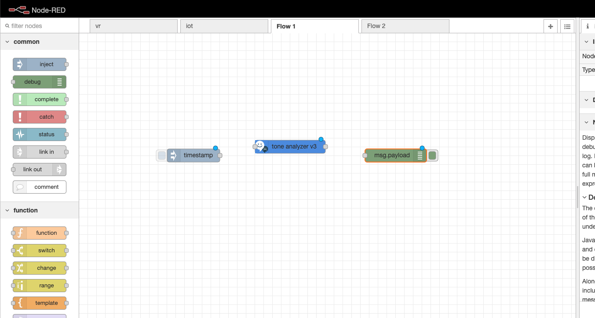

# 3.3 Lab Watson - Personality Insights and Tone Analyzer

Personality Insights service allows to gain insight into how and why people think, act, and feel the way they do. This service applies linguistic analytics and personality theory to infer attributes from a person's unstructured text. Tone Analyzer service uses linguistic analysis to detect joy, fear, sadness, anger, analytical, confident and tentative tones found in text.


# Objective

In the first part on the lab, you will access a Personality Insights quick demo so as to understand the Personality Insights service and its use in an application. With this service you can gain insight into how and why people think, act, and feel the way they do. This service applies linguistic analytics and personality theory to infer attributes from a person's unstructured text. In the second part of the lab, you will create a Watson Personality Insights service and then you will learn how to call it through cURL commands.
You will then access Tone Analyzer quick demos so as to understand the Tone Analyzer service and its use in an application. You will create a Tone Analyzer service and you will then a create a Node-RED application that uses this created service.


+ How to use Watson Personality Insights
+ How to use Watson Tone Analyzer
+ Integrate the service in a web app


# Pre-Requisites

+ Get an IBM Cloud Platform account in the US region (https://cllebrun.github.io/labs/0_Registration/), or use an existing account.


# Steps

1. Personality Insight Demo
1. Personality Insight Service
1. Tone Analyzer Demo
1. Tone Analyzer Service


# Step 1 - Personality Insight Demo

1. Access the Personality Insights quick demo at the following url: https://personality-insights-demo.ng.bluemix.net/

   

   Personality Insights service allows to gain insight into how and why people think, act, and feel the way they do. This service applies linguistic analytics and personality theory to infer attributes from a person's unstructured text.

   The quick demo application allows to analyze text from three sources:
  - Tweets and replies from several people (Oprah Winfrey, LeBron James, Don Francisco, Pope Francis, Mohamed Aboutrika, Sefat Farid Yu Darvish and Sandara Park)
  - Text from several people (Barack Obama, Gandhi and Natsume Soseki) or your own text (more than 100 words)
  - Your own tweets and replies

1.  For tweets and replies analysis, first select a twitter account and   click on the Analyze button.
  You get the results of the analysis in the Output section.
  


  - First output is a summary of the personality.
  - On the right, you can see the consumption preferences.

  The Personality Insights service infers consumption preferences based on the results of its personality profile for the author of the input text. From existing literature, IBM identified 104 consumption preferences that have proved to be correlated with personality. These include preferences that are related to shopping, movies, music, and other categories. IBM then created a psychometric survey to assess an individual's inclination for each consumption behavior.

  IBM obtained responses to its survey from about 600 individuals for whom it also had Twitter data (more than 200 self-authored tweets for each user). IBM submitted the tweets to the service to gather a personality profile for each individual. It then built a classifier for each consumption preference, where the input feature set was the personality information.

  For inclusion with the service, IBM selected only those consumption preferences forwhich personality-based classification performed at least 9 percent better than random classification. Of the original 104 preferences, 42 satisfied this criterion and are exposed as consumption preferences by the service.

  Here is the list of the consumption preferences returned by the service:
  - Shopping preferences: Shopping preferences indicate the author's interest in different types of purchases, the extent to which the author's purchasing habits are influenced by different external sources, and the author's spending habits. This category has 12 preferences.
  - Movie preferences: Movie preferences indicate the author's interest in different types of movies. This category has 10 preferences.
  - Music preferences: Music preferences indicate the author's interest in different types of music and whether the author enjoys playing music. This category has nine preferences.
  - Reading and learning preferences: Reading and learning preferences indicate the author's likelihood to read, the author's motivation for reading, and the types of content the author enjoys reading. This category has five preferences.
  - Health and activities preferences: Health and activity preferences indicate the author's interest in healthy foods and physical activity. This category has three preferences.
  - Entrepreneurship preferences: Entrepreneurship preferences indicate the author's interest in starting a business. This category has one preference.
  - Environmental concern preferences: Environmental concern preferences indicate the author's interest in the environment. This category has one preference.
  - Volunteering preferences: Volunteering preferences indicate the author's interest in volunteering for social causes. This category has one preference.

  Then you can find the models reported by the service:
  - Personality: based on the Big Five model. Big Fives one of the most studied of the personality models that were developed by psychologists Costa and McCrae(1992),and Norman(1963). It is the most widely used personality model to describe how a person generally engages with the world. The service computes the five dimensions and thirty facets of the model. The dimensions are often referred to by the mnemonic OCEAN, where O stands for Openness, C for Conscientiousness, E for Extraversion, A for Agreeableness, and N for Neuroticism. (Because the term Neuroticism can have a specific clinical meaning, the service presents such insights under the more generally applicable heading Emotional range.)For each dimension you can get details by clicking on the arrow sign next to it.
  - Consumer Needs: Needs are an important aspect of human behavior. Research literature suggests that several types of human needs are universal and directly influence consumer behavior (Kotler and Armstrong(2013) and Ford(2005)). The twelve categories of needs that are reported by the service are described in marketing literature as desires that people hope to fulfill when they consider a product or service.
  - Values: Values convey what is most important to an individual. They are "desirable, trans-situational goals, varying in importance, that serve as guiding principles in people's lives" (Schwartz, 2006). Schwartz summarizes five features that are common to all values:
    - Values are beliefs.
    - Values are a motivational construct.
    - Values transcend specific actions and situations.
    - Values guide the selection or evaluation of actions, policies, people, and events.
    - Values vary by relative importance and can be ranked by importance.

    The service computes the five basic human values that were proposed by Schwartz and that were validated in more than twenty countries (Schwartz, 1992).You can get an explanation of each characteristic simply by hovering over it.

3.  Get a sunburst visualization by clicking on the “View personality traits in sunburst visualization” link.

  


4. Feel free to test with your own Twitter account !

# Step 2 - Personality Insight Service

1.  On the IBM Cloud console, navigate to the catalog and look for the **Personality Insights** service. Click on the service tile.

  

1. Choose the Dallas region, the Lite plan and click **Create**. The service instance is created, and the service dashboard page opens automatically.

    

1.  On the Personality Insights service dashboard page, click on Manage.
1.  On the Manage tab, click Show Credentials to view your credentials.
1.  Copy the API Key and URL values.

  The examples described in this document use the curl command to call methods of the HTTP interface. Make sure that you have the curl command installed on your laptop. If not already installed, install the version for your operating system from curl.haxx.se Install the version that supports the Secure Sockets Layer (SSL) protocol. Make sure to include the installed binary file on your PATH environment variable. When you enter a command, replace {apikey} and {url} with your actual API key and URL. Omit the braces, which indicate a variable value, from the command.

  **Send plain text input and receive basic JSON output**

  This first example passes the plain text file profile.txt to the POST /v3/profile method and requests a JSON response.
1.  Download the sample file <a href="https://github.com/cllebrun/cllebrun.github.io/raw/master/labs/3.3%20Lab%20Watson%20-%20Personality%20Insights%20and%20Tone%20Analyzer/profile.txt.zip" download="profile.txt">profile.txt</a>

1.  Issue the following command to send the file to the /v3/profile method and request a JSON response.

  a.  The Content-Type header specifies that the input is plain text, text/plain. The charset parameter included with the header identifies the character encoding of the input text.

  b.  The Accept header specifies application/json to indicate that JSON output is requested.

  c.  Replace {apikey} and {url} with your information.

  d.  Modify {path_to_file} to specify the location of the profile.txt file.

  **Linux version of the command:**

  ```
  curl -X POST -u "apikey:{apikey}" \
  --header "Content-Type: text/plain;charset=utf-8" \
  --header "Accept: application/json" \
  --data-binary @{path_to_file}profile.txt \
  "{url}/v3/profile?version=2017-10-13"
   ```

   **Windows version of the command:**
   ```
   curl -X POST -u "apikey:{apikey}" --header "Content-Type: text/plain;charset=utf-8" --header "Accept: application/json" --data-binary "@{path_to_file}profile.txt" "{url}/v3/profile?version=2017-10-13"
   ```
   The service returns a JSON Profile object that includes basic metadata such as the number of words in the input, the language model with which the input was processed, and any warnings associated with the input. The profile includes information about the Big Five personality, Needs, and Values characteristics for the author as inferred from the input text. The service reports a percentile, or normalized score, for each characteristic. The service computes the percentile by comparing the author's results with the results from a sample population.

   **Send JSON input and receive detailed JSON output**

   In this example, a JSON file is passed to the /v3/profile method, again requesting a JSON response. The example requests consumption preferences and raw scores for a more detailed analysis of the input.

1. Download the sample file <a href="https://cllebrun.github.io/labs/3.3%20Lab%20Watson%20-%20Personality%20Insights%20and%20Tone%20Analyzer/profile.json" download="profile.json">profile.json</a> This file contains a collection of Twitter messages.
1.  Issue the following command to send the file to the /v3/profile method. The example specifies application/json for the Content-Typeand Accept headers; the charset parameter is not needed for JSON input. The example sets the consumption_preferencesand raw_scoresquery parameters to true.

  **Linux version of the command:**

  ```
    curl -X POST -u "apikey:{apikey}" \
  --header "Content-Type: application/json" \
  --header "Accept: application/json" \
  --data-binary @{path_to_file}profile.json \
  "{url}/v3/profile?version=2017-10-13&consumption_preferences=true&raw_scores=true"

  ```

  **Windows version of the command:**
  ```
  curl -X POST -u "apikey:{apikey}" --header "Content-Type: application/json" --header "Accept: application/json" --data-binary @{path_to_file}profile.json "{url}/v3/profile?version=2017-10-13&consumption_preferences=true&raw_scores=true"
  ```
  The service returns a JSON profile that includes the metadata and characteristics returned with the previous example. For each characteristic, the service also includes a raw_score, which represents the author's score for the characteristic based solely on the input text, without comparing the results to a sample population.

  Because the input content includes timestamps, the service also reports behavioral characteristics. These are temporal characteristics that indicate the percentageof the content items that were created on each day of the week and hour of the day.

  The service also reports scores for its collection of consumption preferences. The scores indicate the author's likelihood to prefer different products, services, and activities based on the inferred characteristics.

  **Send JSON input and receive detailed CSV output**

  This example is similar to the previous one: it passes the same JSON content and requests the same results. But this example specifies text/csv for the Accept header to request the response in comma-separated values (CSV) format. It uses the --output option of the curl command to direct the results to a file named profile.csv. The example sets the csv_headers query parameter to true to request that column headers be returned with the output.

  Issue the following command to send the JSON file to the /v3/profile method. The Content-Type header identifies the input content as application/json, and the Accept header requests CSV output, text/csv:

  **Linux version of the command:**

  ```
    curl -X POST -u "apikey:{apikey}" \
  --header "Content-Type: application/json" \
  --header "Accept: text/csv" \
  --data-binary @{path_to_file}profile.json \
  --output profile.csv \
  "{url}/v3/profile?version=2017-10-13&consumption_preferences=true&raw_scores=true&csv_headers=true"

  ```
  **Windows version of the command :**

  ```
    curl -X POST -u "apikey:{apikey}" --header "Content-Type: application/json" --header "Accept: text/csv" --data-binary "@{path_to_file}profile.json" --output profile.csv "{url}/v3/profile?version=2017-10-13&consumption_preferences=true&raw_scores=true&csv_headers=true"
  ```
# Step 3 - Tone Analyzer Demo


1.  Access the Tone Analyzer General purpose quick demo at the following url: https://tone-analyzer-demo.ng.bluemix.net/

   

1.  Select one of the example (Tweets, Online Review, Email message, Product Review in French or Your own text) and click on Analyze. You get the results of the analysis in the Output section.
   

  Here is a description of the different emotional and language tones:
  - Anger: Anger is evoked due to injustice, conflict, humiliation, negligence, or betrayal. If anger is active, the individual attacks the target, verbally or physically. If anger is passive, the person silently sulks and feels tension and hostility. (An emotional tone.)
  - Fear: Fear is a response to impending danger. It is a survival mechanism that is triggered as a reaction to some negative stimulus. Fear can be a mild caution oran extreme phobia. (An emotional tone.)
  - Joy: Joy (or happiness) has shades of enjoyment, satisfaction, and pleasure. Joy brings a sense of well-being, inner peace, love, safety, and contentment. (An emotional tone.)
  - Sadness:  Sadness  indicates  a  feeling of  loss  and  disadvantage.  When  a  person  is  quiet,  less energetic, and withdrawn, it can be inferred that they feel sadness. (An emotional tone.)
  - Analytical: An analytical tone indicates a person's reasoning and analytical attitude about things. An  analytical  person  might  be  perceived  as  intellectual,  rational,  systematic,  emotionless,  or impersonal. (A language tone.)
  - Confident: A confident tone indicates a person's degree of certainty. A confident person might be perceived as assured, collected, hopeful, or egotistical. (A language tone.)
  - Tentative: A tentative tone indicates a person's degree of inhibition. A tentative person might be perceived as questionable, doubtful, or debatable. (A language tone.)

There is an analysis at the document level and an analysis at the sentence level.

# Step 4 - Tone Analyzer service

1.  On the IBM Cloud console, navigate to the catalog and look for the **Tone Analyzer** service. Click on the service tile.

  

1. Choose the Dallas region, the Lite plan and click **Create**. The service instance is created, and the service dashboard page opens automatically.

  

1.  On the Manage tab, click Show Credentials to view your credentials.
1.  Copy the API Key and URL values.

1. You will use Node-RED in the following steps. If you already have a running instance of Node-RED, you can use it and go to 6. . Otherwise, you need to follow the next steps:
  - On the IBM Cloud dashboard, select Catalog from the menu bar.
  - Enter Node-RED in Search the catalog.
  - Click on Node-RED Starter.
  - Give a name for the application, select the Default plan and click on Create.
  - Wait for your application to start and then click on **Visit App URL**.
  - Follow the instructions to secure your Node-RED application.
  - Click on **Go to your Node-RED editor**

1.  Open a new tab on your Node-RED editor.
1.  Drag and drop the Tone Analyzer node on the workspace.
    
1.  Double-click on the node to edit its properties. Provide the API Key, make sure the endpoint is the right one. Chose the method "General tone" and set "version_date" to "multiple tone".

  

1.  Click on Done.
1.  Drag and drop an inject node and a debug node from the palette.

  

1.  Wire the nodes together.

  

1.  Double-click the timestamp node to edit its properties.
1.  For the Payload select String and enter the sentences that you want to be analyzed. Here is an example that you can use: **“Team, I know that times are tough! Product sales have been disappointing for the past three quarters. We have a competitive product, but we need to do a better job of selling it!”**

1.  Click on Done.
1.  Double click the msg.payload node to edit its properties.
1.  Replace the word **payload** by the word **response**.

  

1.  Click on Done.
1.  Click on Deploy.
1.  Open the debug tab on the right panel
1.  Run the flow by clicking on the left of the inject node.
1.  You should get a Successfully injected message.
1.  You can visualize the response by clicking on the Debug console.
1.  You can see the output of the Tone Analyzer service in the response object.

  

The service returns a JSON object that always contains a document_tonefield. This field contains an object that provides the analysis of the full input document. It contains a single field, tones, that provides the results of the analysis for each qualifying tone of the document.

If the sentences parameter of the request is omitted or set to true, the response also includes a sentences_tonefield. This field contains an array of objects, each of which provides the following information for a different sentence from the input content:
- sentence_id(integer) provides the unique identifier for the sentence. The first sentence has ID 0, and the ID of each subsequent sentence is incremented by one.
- text(string) provides the text of the sentence.
- tones provides the results of the analysis for each qualifying tone of the sentence.

Feel free to test your own text by modifying the payload message in the inject node.

# Resources

For additional resources pay close attention to the following:

- [Watson Personality Insights Documentation](https://cloud.ibm.com/docs/services/personality-insights?topic=personality-insights-gettingStarted)

- [Watson Personality Insights API Reference](https://cloud.ibm.com/apidocs/personality-insights)

- [Watson Tone Analyzer Documentation](https://cloud.ibm.com/docs/services/tone-analyzer?topic=tone-analyzer-about&_ga=2.9548789.1595110995.1575383823-679962596.1538488997&cm_mc_uid=66302025876115544728192&cm_mc_sid_50200000=78316381575389656642&cm_mc_sid_52640000=41254171575389656644#about)

- [Watson Tone Analyzer API Reference](https://cloud.ibm.com/apidocs/tone-analyzer?_ga=2.175141858.1595110995.1575383823-679962596.1538488997&cm_mc_uid=66302025876115544728192&cm_mc_sid_50200000=78316381575389656642&cm_mc_sid_52640000=41254171575389656644)
