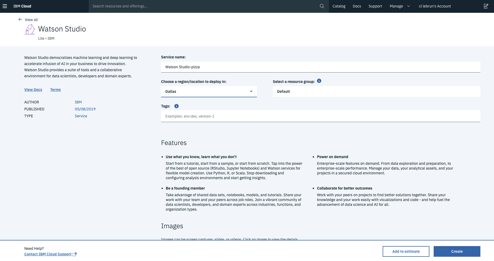
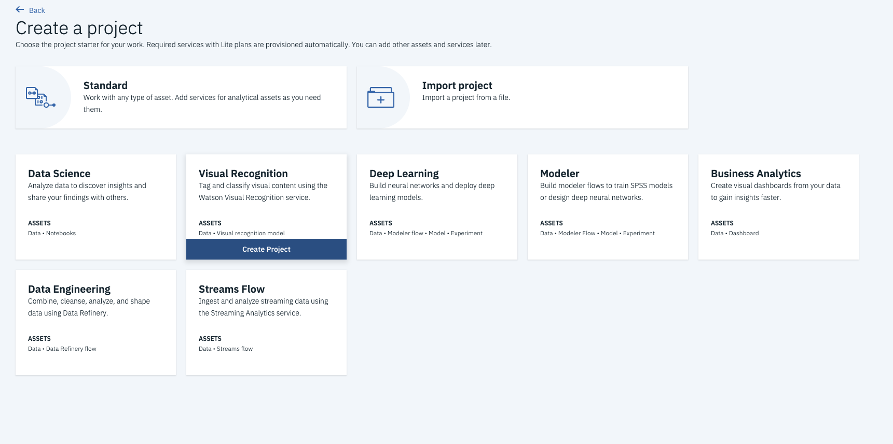
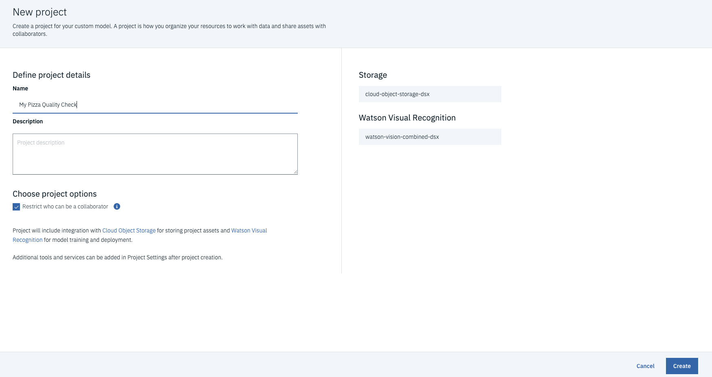

# 3.3 Lab Watson - Watson Visual Recognition - Introduction

Watson Visual Recognition understands an image’s content out-of-the-box. The pre-trained models enable you to analyze images for objects, faces, colors, food, explicit content and other subjects for insights into your visual content.

Watson can also learn any new object, person, or attribute.

With only a few images, the computer vision service can learn any new object, person, or attribute such as identifying car type and damage to estimate repair costs. Train models effortlessly with Watson Studio — a free workspace where you can seamlessly create, evaluate, and manage your custom models.

In this lab, you go through a step-by-step process to use Watson Visual Recognition out-of-the-box and then you will create your own custom model using the integrated tooling available on IBM Cloud.

# Objective

In the following lab, you will learn:

+ How to use the Watson Visual Recognition API
+ How to use the Watson Studio tools to create your own custom model
+ Integrate the service in a web app

# Pre-Requisites

+ Get an [IBM Cloud Platform account] in the US region (https://cllebrun.github.io/labs/0_Registration/), or use an existing account.

# Steps

1. Using Visual Recognition with UI
2. Creating custom classifier with UI
3. Integrate Visual Recognition in your application with Node-Red

# Step 1 - Using Visual Recognition with UI

The first part of this lab will show you how to create a Visual Recognition Service, and use its tooling to test Watson provided models.

1. Login to IBM Cloud. https://cloud.ibm.com/login

2. Go to the IBM Cloud **Catalog** and select AI category.

 

3. Then click the **Watson Studio** tile, then choose a name for your service (e.g. Watson Studio-pizza), in the **DALLAS** region, then click the Create button.

 
Watson Studio is the tool for building AI models in a collaborative fashion so you can provide a more democratic training process that reduces AI biases.

4. Click the Get Started button to open Watson Studio.
5. Click the Get Started button when prompt.

6. Click **Create a project**.
   
7. Select **Visual Recognition** type of project.
   

8. Select the **US South** region.
   

9. Enter a name for your project (e.g. My Pizza Quality Check) and a description if you like then click the **Create** button. This project will create a Watson Visual Recognition service and the needed Cloud Object Storage.
   

   Great! You have created a new machine learning project that you can collaborate on with others, upload data-sets, and create training models. Additionally, this project wizard has instantiated the Watson Visual Recognition service that is pre-trained on millions of consumer oriented images and can be used with no additional training (as we'll see below).

   However, since consumer data represents only 20% of the world's data, we will create a custom model below to teach Watson your business and what insights are in your images that consumer trained visual recognition software just doesn't cover.

**Test the General model:**

Before creating a custom model, let's check out the General model and the Food model that IBM has already trained on millions of images.

10. Click the **watson-visual-combined-dsx** link for the Watson Visual Recognition service that was automatically created for you.
   

11. Click the Test button of the General model panel.

12. Click the Test tab of this model to upload an unlabeled image that Watson will examine to determine what insights can be gleaned from Watson's training of millions of images.
  

13. Locate your favorite image search tool to find test images, use your personal images or drag images from [Test images folder]()
