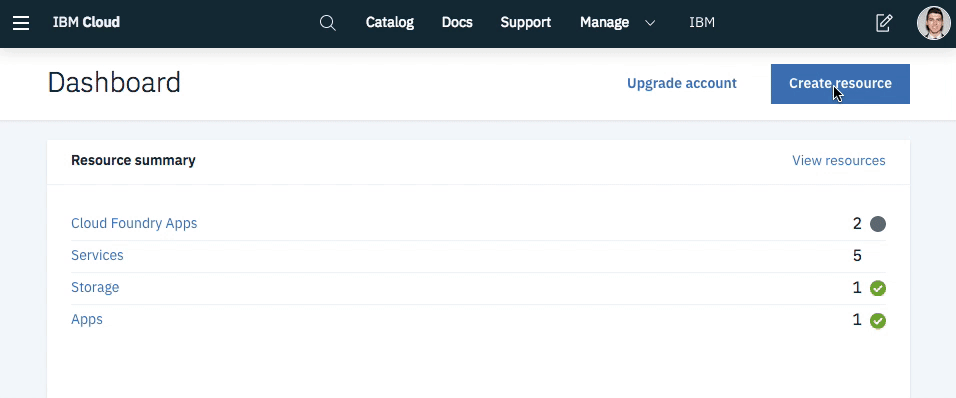
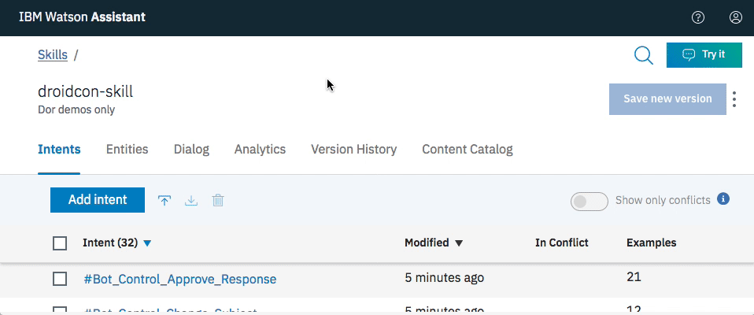

visualise
# 3.4 Lab Android - Watson Assistant


This lab is an introduction to IBM Cloud and Watson and its possibilities. You will need an IBM Cloud account in order to create your web application. Watson AI services can help you make your Android apps more accessible. Following this lab, you will learn how to create an Android-native voice-enabled chatbot with Watson services.

The use case is about a Hotel Concierge Virtual assistant that could be accessed from the guest room, the hotel lobby or directly from the customers phones.
Targeted end-users are Hotel customers.


# Objective

+ Discover IBM Watson APIs
+ Get started with the Watson Assistant tool on IBM cloud
+ Integrate Watson services in your Android mobile application


# Pre-Requisites

+ Download and install [Android Studio](https://developer.android.com/studio/index.html).
+ Get an [IBM Cloud account](https://cloud.ibm.com/registration/?cm_mmc=droidcon2019), or use an existing account.


You have access to a Lite IBM Cloud account for free.


# Steps

1. Create Watson services on your IBM Cloud account

2. Work with Watson Assistant

3. Integrate with your Android mobile application


# Step 1 - Create Watson services on your IBM Cloud account

In this section, you will create the services required by the tutorial starting with Watson Assistant to build cognitive virtual assistants that help your customers.

### Watson Assistant

+ Go to the [**IBM Cloud Catalog**](https://cloud.ibm.com/catalog/) and select [Watson Assistant](https://cloud.ibm.com/catalog/services/watson-assistant-formerly-conversation) service > Lite plan. Click Create.




+ Click Service credentials on the left pane, click New credential and click Add.
+ Click View Credentials to see the credentials. Make note of the API Key and URL, you will need it for the mobile application.


### Speech to Text

The Speech to Text service converts the human voice into the written word that can be sent as an input to Watson Assistant service on IBM Cloud™.

+ Go to the [**IBM Cloud Catalog**](https://cloud.ibm.com/catalog/) and select [Speech to Text](https://cloud.ibm.com/catalog/services/speech-to-text) service > Lite plan. Click **Create**.
+ Click **Service credentials** on the left pane and click **New credential** to add a new credential. Click **Add**.
+ Click **View Credentials** to see the credentials. Make note of the **API Key** and **URL**, you will need it for the mobile application.

### Text to Speech

The Text to Speech service processes text and natural language to generate synthesized audio output complete with appropriate cadence and intonation. The service provides several voices and can be configured in the Android app.

+ Go to the [**IBM Cloud Catalog**](https://cloud.ibm.com/catalog/) and select [Text to Speech](https://cloud.ibm.com/catalog/services/text-to-speech) service > Lite plan. Click **Create**.
+ Click **Service credentials** on the left pane and click **New credential** to add a new credential. Click **Add**.
+ Click **View Credentials** to see the credentials. Make note of the **API Key** and **URL**, you will need it for the mobile application.

# Step 2 - Work with Watson Assistant
+ On the top left, click on the hamburger menu and select the **Dashboard**

  

From the IBM Cloud Dashboard, on the resource summary, you can visualise your apps, containers and services you have provisioned.
+ Select your instance of **Watson Assistant** from the services category.
+ Click on the **Launch Tool** button to start the Watson Assistant visual tool.

## Create a skill

A skill is a container for the artifacts that define the conversation flow.

For this tutorial, you will save and use <a href="cllebrun.github.io/labs/3.4 Lab Android - Watson Assistant/concierge.json" download="concierge.json">concierge.json</a> file with predefined intents, entities and dialog flow to your machine.

## Link the skill to an assistant
An **assistant** is a cognitive bot that you can customize for your business needs, and deploy across multiple channels to bring help to your customers where and when they need it. You customize the assistant by adding to it the skills it needs to satisfy your customers' goals.

+ In the Watson Assistant tool, switch to **Assistants** and use **Create new**. Click **Create**.
+ Use **Add Dialog skill** to select the skill created in the previous sections.
  + **Add existing skill**
  + Select **Ana**
+ Under **View API Details** for the assistant, make note of the **Assistant ID**, you will need to reference it from the mobile application (in the `config.xml` file of the Android app).



# Step 3 - Integrate with your Android mobile application

The repository contains Android application code with required gradle dependencies.

+ Run the below command to clone the GitHub repository:
```
git clone https://github.com/IBM-Cloud/chatbot-watson-android
```

+ Launch Android Studio > **Open an existing Android Studio project** and point to the downloaded code. **Gradle** build will automatically be triggered and all the dependencies will be downloaded.
+ Open `app/src/main/res/values/config.xml` to see the placeholders (`ASSISTANT_ID_HERE`) for service credentials. Enter the service credentials (you saved earlier in step 1) in their respective placeholders and save the file.
+ Build the project and start the application on a real device or with a simulator.
+ **Enter your query** in the space provided below and click the arrow icon to send the query to Watson Assistant service.
+ The response will be passed to Text to Speech service and you should hear a voice reading out the response.
+ Click the **mic** icon in the left bottom corner of the app to input speech that gets converted to text and then can be sent to Watson Assistant service by clicking the arrow icon.

# Cleanup
To remove the resources that you have created following this lab:
+ Navigate to [Resource List](https://cloud.ibm.com/resources/)
+ Delete the services you have created:
  + IBM Watson™ Assistant
  + IBM® Speech to Text
  + IBM® Text to Speech

# Other resources
+ [Original tutorial](https://cloud.ibm.com/docs/tutorials?topic=solution-tutorials-android-watson-chatbot)
+ [Java SDK](https://github.com/watson-developer-cloud/java-sdk)
+ [IBM Watson Documentation](https://cloud.ibm.com/developer/watson/documentation)
+ [Android SDK](https://github.com/watson-developer-cloud/android-sdk)*

\* This is an Android client library to assist with using the Watson services, a collection of REST APIs and SDKs that use cognitive computing to solve complex problems. This SDK is built for use with the Watson Java SDK.
