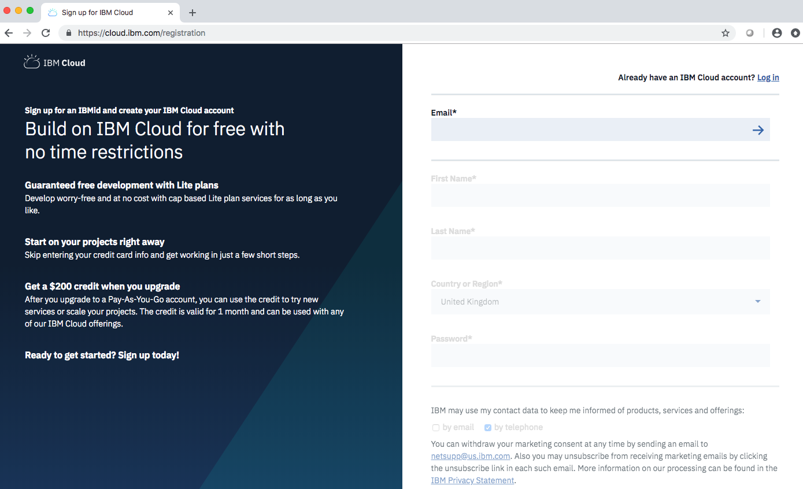

# 3.4 Lab Android - Watson Assistant

This lab is an introduction to IBM Cloud and Watson and its possibilities. You will need an IBM Cloud account in order to create your web application. Watson AI services can help you make your Android apps more accessible. Following this lab, you will learn how to create an Android-native voice-enabled chatbot with Watson services.

# Objective

+ Discover IBM Watson APIs
+ Get started with the Watson Assistant tool on IBM cloud
+ Integrate Watson services in your Android mobile application

# Pre-Requisites

+ Download and install [Android Studio](https://developer.android.com/studio/index.html).
+ Get an [IBM Cloud account](https://cloud.ibm.com/registration/?cm_mmc=droidcon2019), or use an existing account.

You have access to a Lite IBM Cloud account for free.

# Steps

1. Create Watson services on your IBM Cloud account

2. Work with Watson Assistant

3. Integrate with your Android mobile application

# Step 1 - Create Watson services on your IBM Cloud account

In this section, you will create the services required by the tutorial starting with Watson Assistant to build cognitive virtual assistants that help your customers.

### Watson Assistant

+ Go to the [IBM Cloud Catalog](https://cloud.ibm.com/catalog/) and select [Watson Assistant](https://cloud.ibm.com/catalog/services/watson-assistant-formerly-conversation) service > Lite plan. Click Create.

+ Click Service credentials on the left pane, click New credential and click Add.
+ Click View Credentials to see the credentials. Make note of the API Key and URL, you will need it for the mobile application.

### Speech to Text

The Speech to Text service converts the human voice into the written word that can be sent as an input to Watson Assistant service on IBM Cloud™.

+ Go to the [IBM Cloud Catalog](https://cloud.ibm.com/catalog/) and select [Speech to Text](https://cloud.ibm.com/catalog/services/speech-to-text) service > Lite plan. Click Create.
+ Click Service credentials on the left pane and click New credential to add a new credential. Click Add.
+ Click View Credentials to see the credentials. Make note of the API Key and URL, you will need it for the mobile application.

### Text to Speech

The Text to Speech service processes text and natural language to generate synthesized audio output complete with appropriate cadence and intonation. The service provides several voices and can be configured in the Android app.

+ Go to the [IBM Cloud Catalog](https://cloud.ibm.com/catalog/) and select [Text to Speech](https://cloud.ibm.com/catalog/services/text-to-speech) service > Lite plan. Click Create.
+ Click Service credentials on the left pane and click New credential to add a new credential. Click Add.
+ Click View Credentials to see the credentials. Make note of the API Key and URL, you will need it for the mobile application.

# Step 2 - Work with Watson Assistant

## Create a skill

## Link the skill to an assistant
An **assistant** is a cognitive bot that you can customize for your business needs, and deploy across multiple channels to bring help to your customers where and when they need it. You customize the assistant by adding to it the skills it needs to satisfy your customers' goals.

+ In the Watson Assistant tool, switch to **Assistants** and use **Create new**. Click **Create**.
+ Use **Add Dialog skill** to select the skill created in the previous sections.
  + **Add existing skill**
  + Select **Ana**
+ Under **View API Details** for the assistant, make note of the **Assistant ID**, you will need to reference it from the mobile application (in the config.xml file of the Android app).

# Step 3 - Integrate with your Android mobile application
