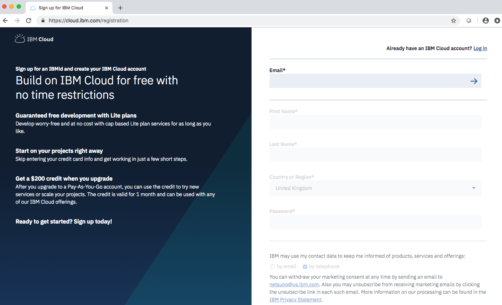
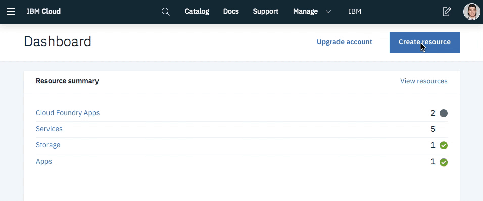
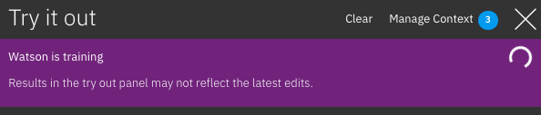
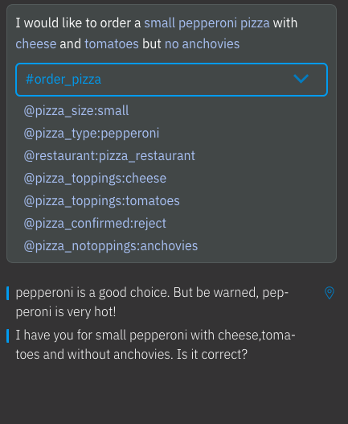
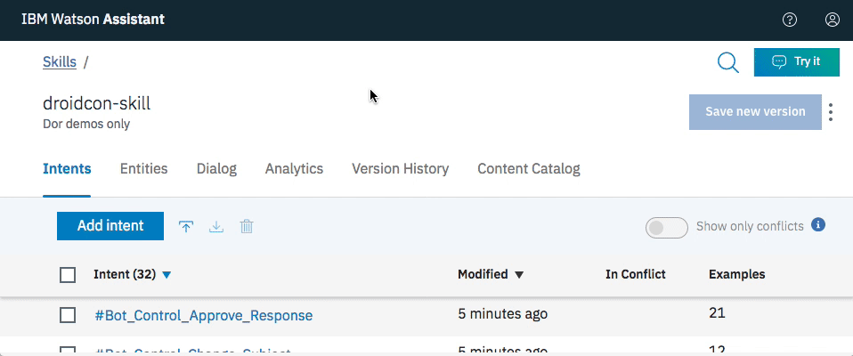
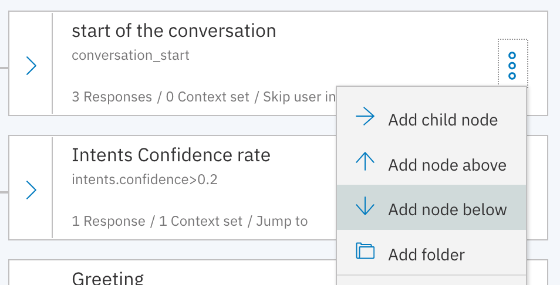

# 3.6 Lab Android - Watson Assistant


This lab is an introduction to IBM Cloud and Watson and its possibilities. You will need an IBM Cloud account in order to create your web application. Watson AI services can help you make your Android apps more accessible. Following this lab, you will learn how to create an Android-native voice-enabled chatbot with Watson services.

The use case is about a Hotel Concierge Virtual assistant that could be accessed from the guest room, the hotel lobby or directly from the customers phones.
Targeted end-users are Hotel customers.


# Objective

+ Discover IBM Watson APIs
+ Get started with the Watson Assistant tool on IBM cloud
+ Integrate Watson services in your Android mobile application


# Pre-Requisites

+ Download and install [Android Studio](https://developer.android.com/studio/index.html).
+ Get an [IBM Cloud account](https://cloud.ibm.com/registration/?cm_mmc=droidcon2019), or use an existing account.


You have access to a Lite IBM Cloud account for free.


# Steps

1. Create Watson services on your IBM Cloud account

2. Work with Watson Assistant

3. Integrate with your Android mobile application

3. Extend your chatbots skills


# Step 1 - Create Watson services on your IBM Cloud account

In this section, you will create the services required by the tutorial starting with Watson Assistant to build cognitive virtual assistants that help your customers.

### Watson Assistant

+ Go to the [**IBM Cloud Catalog**](https://cloud.ibm.com/catalog/) and select [Watson Assistant](https://cloud.ibm.com/catalog/services/watson-assistant-formerly-conversation) service > Lite plan. Click Create.




+ Click **Service credentials** on the left pane and verify that "Auto-generated credentials" have been created for you.
  + If there are none click **New credential** and click **Add**.
+ Click **View Credentials** to see the credentials. Make note of the **API Key** and **URL**, you will need it for the mobile application.


### Speech to Text

The Speech to Text service converts the human voice into the written word that can be sent as an input to Watson Assistant service on IBM Cloud™.

+ Go to the [**IBM Cloud Catalog**](https://cloud.ibm.com/catalog/) and select [Speech to Text](https://cloud.ibm.com/catalog/services/speech-to-text) service > Lite plan. Click **Create**.
+ Click **Service credentials** on the left pane and verify that "Auto-generated credentials" have been created for you.
  + If there are none click **New credential** to add a new credential. Click **Add**.
+ Click **View Credentials** to see the credentials. Make note of the **API Key** and **URL**, you will need it for the mobile application.

### Text to Speech

The Text to Speech service processes text and natural language to generate synthesized audio output complete with appropriate cadence and intonation. The service provides several voices and can be configured in the Android app.

+ Go to the [**IBM Cloud Catalog**](https://cloud.ibm.com/catalog/) and select [Text to Speech](https://cloud.ibm.com/catalog/services/text-to-speech) service > Lite plan. Click **Create**.
+ Click **Service credentials** on the left pane and verify that "Auto-generated credentials" have been created for you.
  + If there are none click **New credential** to add a new credential. Click **Add**.
+ Click **View Credentials** to see the credentials. Make note of the **API Key** and **URL**, you will need it for the mobile application.

# Step 2 - Work with Watson Assistant
+ On the top left, click on the hamburger menu and select the **Dashboard**

  

From the IBM Cloud Dashboard, on the resource summary, you can visualise your apps, containers and services you have provisioned.
+ Select your instance of **Watson Assistant** from the services category.
+ Click on the **Launch Tool** button to start the Watson Assistant visual tool.

## Create a skill

A skill is a container for the artifacts that define the conversation flow.

For this tutorial, you will save and use <a href="https://cllebrun.github.io/labs/3.4%20Lab%20Android%20-%20Watson%20Assistant/VirtualConcierge.json" download="VirtualConcierge.json">VirtualConcierge.json</a> file with predefined intents, entities and dialog flow to your machine.

+ Click on the **Skills** tab.
+ **Create new** then **Import skill** and choose the JSON file downloaded above.
+ Select **Everything** option and click **Import**. A new skill named "Virtual Concierge" is created with predefined intents, entities and dialog flow.

+ On the Dialog tab, you can design and test your conversation. Open the **Try it out** panel on the top right.
Try it panel is used for testing in the lab guide.
When WA is training on recently added data. You must wait for the message highlighted with purple to clear before you can test newly added intents, utterances, entities. Watson will respond, but you will get unpredictable results until the training is complete.

  

+ For example, you can ask your virtual concierge to order a pizza, specifying the toppings and the size of your pizza:
"I would like to order a small pepperoni pizza with cheese and tomatoes but no anchovies"

You will get how Watson Assistant understood your request, what intent and which entities it recognizes. You get the answer which comes from your dialog design.

  
+ You can also ask about gym, sauna, restaurant opening hours, ask for information about different types of restaurants ...
+ You can find the several topics Watson Assistant handles in this specific virtual concierge skill <a href="https://app.mindmup.com/map/_free/2019/04/e3bdd970548e11e9891b57e20ba3b8b1" >here</a> and try it out directly in this tool !

## Link the skill to an assistant
An **assistant** is a cognitive bot that you can customize for your business needs, and deploy across multiple channels to bring help to your customers where and when they need it. You customize the assistant by adding to it the skills it needs to satisfy your customers' goals.

+ In the Watson Assistant tool, switch to **Assistants** and use **Create new**. Click **Create**.
+ Use **Add Dialog skill** to select the skill created in the previous sections.
  + **Add existing skill**
  + Select **Virtual Concierge**
+ Under **View API Details** for the assistant, make note of the **Assistant ID**, you will need to reference it from the mobile application (in the `config.xml` file of the Android app).



# Step 3 - Integrate with your Android mobile application

The repository contains Android application code with required gradle dependencies.

+ Run the below command to clone the GitHub repository:
```
git clone https://github.com/rogerxaic/chatbot-watson-android.git
```

+ Launch Android Studio > **Open an existing Android Studio project** and point to the downloaded code. **Gradle** build will automatically be triggered and all the dependencies will be downloaded.
+ Open `app/src/main/res/values/config.xml` to see the placeholders (`ASSISTANT_ID_HERE`) for service credentials. Enter the service credentials (you saved earlier in step 1) in their respective placeholders and save the file.

*Note that the `ASSISTANT_ID` refers to the assistant you've created in step 2 and the other API keys/Urls refer to the services you've created in step 1.*
+ Build the project and start the application on a real device or with a simulator.

+ **Enter your query** in the space provided below and click the arrow icon to send the query to Watson Assistant service.
+ The response will be passed to Text to Speech service and you should hear a voice reading out the response.
+ Click the **mic** icon in the left bottom corner of the app to input speech that gets converted to text and then can be sent to Watson Assistant service by clicking the arrow icon.

# Step 4 - Extend your chatbots skills

You are now going to extend your chatbot skills by adding a new intent to be recognized and working on the dialog flow.

+ In Watson Assistant, go to your **Intents** tab in your skill "Virtual Concierge". Note that there is one existing intent defined called "General_Jokes". We are going to use this intent to add a "telling jokes" skill to our bot!

+ Switch to the **Dialog** tab.
+ Add a node below the **start of the conversation** node:

  

+ Name it **Jokes**
+ Complete with "If assistant recognizes:" **General_Jokes**. This tests if the assistant recognizes this specific intent.

+ Click on the 3 dots next to the "Then respond with" and open the JSON editor.
+ In the **values** table, add the following values:
```
         {
           "text": "What's the advantage of living in Switzerland? Well, the flag is a big plus."
         },
         {
           "text": "Why did the chicken cross the road? To get to the other side."
         },
         {
           "text": "People are making apocalypse jokes like there's no tomorrow."
         },
         {
           "text": "What's the most important letter in the British alphabet? T"
         },
         {
           "text": "What's yellow and hurts when it gets in your eye? A bulldozer."
         },
         {
           "text": "Did you hear about the restaurant on the moon? Great food, no atmosphere."
         },
         {
           "text": "What do you call a fake noodle? An Impasta."
         },
         {
           "text": "How many apples grow on a tree? All of them."
         },
         {
           "text": "Want to hear a joke about paper? Nevermind it's tearable."
         },
         {
           "text": "I just watched a program about beavers. It was the best dam program I've ever seen."
         },
         {
           "text": "Why did the coffee file a police report? It got mugged."
         },
         {
           "text": "How does a penguin build it's house? Igloos it together."
         },
         {
           "text": "Dad, did you get a haircut? No I got them all cut."
         },
         {
           "text": "What do you call a Mexican who has lost his car? Carlos."
         },
         {
           "text": "Dad, can you put my shoes on? No, I don't think they'll fit me."
         },
         {
           "text": "Why did the scarecrow win an award? Because he was outstanding in his field."
         },
         {
           "text": "Why don't skeletons ever go trick or treating? Because they have no body to go with."
         },
         {
           "text": "I'll call you later. Don't call me later, call me Dad."
         },
         {
           "text": "Want to hear a joke about construction? I'm still working on it."
         },
         {
           "text": "What do you call cheese that isn't yours? Nacho Cheese."
         },
         {
           "text": "Whenever the cashier at the grocery store asks my dad if he would like the milk in a bag he replies, \"No, just leave it in the carton!\""
         },
         {
           "text": "5/4 of people admit that they’re bad with fractions."
         },
         {
           "text": "Two goldfish are in a tank. One says to the other, \"do you know how to drive this thing?\""
         },
         {
           "text": "The rotation of earth really makes my day."
         },
         {
           "text": "What's brown and sticky? A stick."
         },
         {
           "text": "Why do you never see elephants hiding in trees? Because they're so good at it."
         },
         {
           "text": "A furniture store keeps calling me. All I wanted was one night stand."
         },
         {
           "text": "I'm so good at sleeping. I can do it with my eyes closed."
         },
         {
           "text": "When you look really closely, all mirrors look like eyeballs."
         },
         {
           "text": "My friend says to me: \"What rhymes with orange\" I said: \"No it doesn't\""
         },
         {
           "text": "I couldn't figure out why the baseball kept getting larger. Then it hit me."
         },
         {
           "text": "What do you call a frenchman wearing sandals? Phillipe Phillope."
         },
         {
           "text": "I know a lot of jokes about unemployed people but none of them work."
         },
         {
           "text": "My wife is really mad at the fact that I have no sense of direction. So I packed up my stuff and right."
         }
```
These are examples of jokes Watson could answer.

+ Still on this JSON editor, on the last line, replace the value **sequential** by **random** for the "selection_policy"
+ Close the node and try it out! Watson may take some seconds to retrain, then ask him to tell you a joke!

+ Add another response type to your node: Open your **Jokes** node again
+ Under your text response click on **Add response type**
+ Select **Image**
+ Add a title like "GIF" and a description like "an image of a bear saying HA HA HA"
+ Add a URL for the gif, for example:
```
https://media2.giphy.com/media/3oFzlW4yxJIGR4SrSg/giphy.gif?cid=790b76115ca367ef554b44792eb4312a
```

Test your chatbot. It's now returning two types of responses when you ask him to tell a joke.


# Cleanup
To remove the resources that you have created following this lab:
+ Navigate to [Resource List](https://cloud.ibm.com/resources/)
+ Delete the services you have created:
  + IBM Watson™ Assistant
  + IBM® Speech to Text
  + IBM® Text to Speech

# Other resources
+ [Original tutorial](https://cloud.ibm.com/docs/tutorials?topic=solution-tutorials-android-watson-chatbot)
+ [Java SDK](https://github.com/watson-developer-cloud/java-sdk)
+ [IBM Watson Documentation](https://cloud.ibm.com/developer/watson/documentation)
+ [Android SDK](https://github.com/watson-developer-cloud/android-sdk)*

\* This is an Android client library to assist with using the Watson services, a collection of REST APIs and SDKs that use cognitive computing to solve complex problems. This SDK is built for use with the Watson Java SDK.
