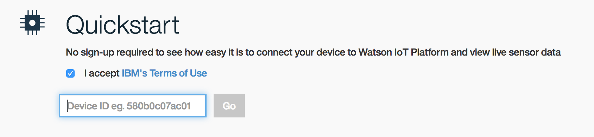
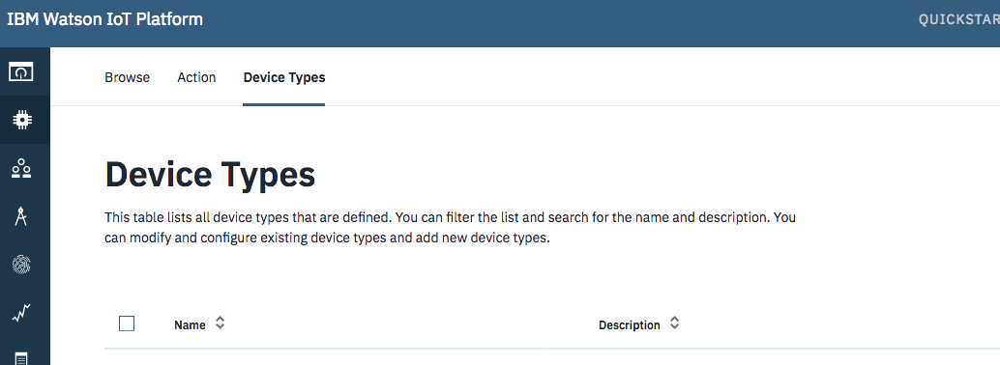

# 4.1 Lab IoT - Simulator - Node-RED - Introduction

This tutorial demonstrates how to connect a simulated device to the Watson IoT platform, visualize its live data, store its data into a database and leverage [Node-RED](http://www.nodered.org){:target="_blank"} tool for wiring together hardware devices, APIs and online services.


# Objectives
* You will simulate a temperature sensor.
* You will collect sensor data from a Watson IoT service.
* You will discover how to leverage Node-RED to connect IoT.
* You will store the collected data into a NoSQL database.
* You will use Watson to translate messages.


# Pre-Requisites
* An [IBM Cloud Platform](http://console.bluemix.net/){:target="_blank"} account


# Start the simulated device

We will use a simulator of a temperature sensor. This sensor also simulates Humidity and Object Temperature.<br />
This way, we don't require an actual hardware device to test our application.

1. In a new browser window or on a smartphone, browse to [IoT Sensor](http://quickstart.internetofthings.ibmcloud.com/iotsensor){:target="_blank"}.
<br />Alternatively, enter this short URL: http://ibm.biz/iotsensor

   

1. Note the Device Id (displayed in the top right corner).


# View the live sensor data

1. In a new browser window, browse to [Watson IOT Platform quickstart](https://quickstart.internetofthings.ibmcloud.com){:target="_blank"}.
<br />Alternatively, enter this short URL: http://ibm.biz/iotquickstart

    

1. Enter the device id.

1. Vizualise the live sensor data and play with the dynamic graph.


# Connect your device to the Watson IoT Platform

You've seen your data, what next? Now you will see how to use theses sensors data in an application created with the IBM Cloud Platform.

1. Open your Node-RED application

1. Open a new tab


1. Import the following flow:

    ```
    [{"id":"1bb9574b.5f4329","type":"ibmiot out","z":"e3fcda06.646918","authentication":"boundService","apiKey":"","outputType":"evt","deviceId":"temperatures","deviceType":"device1","eventCommandType":"update","format":"json","data":"temp:10","qos":"","name":"Send to IBM IoT Platform","service":"registered","x":690,"y":840,"wires":[]},{"id":"415bb36f.00529c","type":"inject","z":"e3fcda06.646918","name":"Send Data","topic":"","payload":"true","payloadType":"bool","repeat":"3","crontab":"","once":false,"onceDelay":"","x":130,"y":840,"wires":[["8f9b2118.9fdce"]]},{"id":"db314703.cbeb38","type":"debug","z":"e3fcda06.646918","name":"Debug output payload","active":false,"console":"false","complete":"payload","x":800,"y":900,"wires":[]},{"id":"a35c484d.923e38","type":"comment","z":"e3fcda06.646918","name":"2. Click to send data","info":"To automatically send data:\n1. Change *Repeat* to interval.\n2. Click Deploy button.\n","x":130,"y":880,"wires":[]},{"id":"8f9b2118.9fdce","type":"function","z":"e3fcda06.646918","name":"Device payload","func":"// Thermostat's location:\nvar longitude1 = -98.49;\nvar latitude1 = 29.42;\n\n// Array of pseudo random temperatures\nvar sensor42 = [9,10,11.5,14,16,12,11,10,12.5,11.5];  // plafond\n\n// Array of pseudo random temperatures\nvar sensor255 = [52,55,61,68,65,60,53,52,51,47];  //sol\n\n// Array of pseudo random temperatures\nvar sensor404 = [15,17,18.5,20,21.5,23,24,22.2,19,18]; //int\n\n// Array of pseudo random temperatures\nvar sensor8086 = [25,22,26,21,19,22.5,21,23,25,18]; //ext\n\n\n\n// Counter to select from array.\nvar counter1 = context.get('counter1')||0;\ncounter1 = counter1+1;\nif(counter1 > 9) counter1 = 0;\ncontext.set('counter1',counter1);\n\n// Create MQTT message in JSON\nmsg = {\n  payload: JSON.stringify(\n    {\n      d:{\n        \"sensor42\" : sensor42[counter1],\n        \"sensor404\" : sensor404[counter1],\n        \"sensor255\" : sensor255[counter1],\n        \"sensor8086\" : sensor8086[counter1],\n        \"location\" :\n        {\n          \"longitude\" : longitude1,\n          \"latitude\" : latitude1\n        },\n      }\n    }\n  )\n};\nreturn msg;\n","outputs":1,"noerr":0,"x":340,"y":940,"wires":[["db314703.cbeb38"]]}]
    ```

# Use Node-RED to read the sensor data


1. In the Authentication type field, select **Quickstart** from the pull-down list. Enter the Device ID field (you get it from the web simulator) and click OK.
<br />*Make sure that the device id is entered in lowercase, and that there are no leading or trailing space characters.*

1. Look for the **Deploy** button in the upper right hand corner of your Node-RED workspace. The deploy button is now red; click it to deploy your flow.

    

1. Open the debug pane on the right. You will see that the flow is generating Temperature Status messages.

1. Increase the temperature value on the simulator to see the messages change in the debug pane.
<br /> *Note that a different message appears if the temperature exceeds 40 degrees.*

# Store the device data into a No SQL database

1. In Node-RED flow editor, add a **Cloudant out** node

    

1. In the Service type field, select the name of Cloudant service bound to Node.js runtime from the pull-down list.
<br />Enter a dabatase name in lowercase. Keep the default operation insert and finally give a name to the node.

    

1. Deploy the flow. Return to the IBM Cloud Platform console, on the app overview, click on "Connections" and on to the Cloudant service. Click on the green button to "Launch" the Cloudant web UI. Navigate into the DB records.

    

In your Node-RED flow editor, you can then delete the link between your IoT node and your Cloudant node if you want to stop storing data.

# Connect with the Watson IoT Platform.

The first flow simulate a device publishing an event. To visualize the data in you Watson IoT platform organization you need to register the simulated device in your organization.

1. Return to the IBM Cloud Platform console, from the "Connections" tab in your application dashboard, click on the IoT service -> launch it.

1. From the Internet of Things service dashboard, access your IoT organisation and add your device to it: Select the Devices tab on the left.

1. Select the "Device Types" tab.

    

1. Add Device Type (up and right).

1. Give it a name: "thermostat". Click "Next"

1. Leave the other options by default and click "Done".

1. Now you are going to register a device. Click "Register Devices"

    

1. Enter a device ID: "LivingRoomThermo1". Click Next, Next

1. At the security step, chose an identification token (8 characters minimum)

1. Click "Done"

1. Go to Node-RED, open and modify the inject node to publish events continuously (repeat -> onterval -> every 3 seconds):

    

1. You can see events in the Watson IoT dashboard

   


# Translate messages with Watson.

The warning messages generated in Node-RED uses English by default. You may want to translate those messages into your oww language.

1. In the IBM Cloud Platform console, create a new service **Language Translator** (from the catalog)

    

1.  Connect it to your app to your app (from the Connection tab in your app dashboard). Restage your app.

    

1. Wait for your app to start again. In Node-RED flow editor, add a new **Language Translator** node to the flow.

1. Modify the flow accordingly to translate those messages.

    

1. Deploy the updated flow.

1. Observe the translated output based on the selected language.


# Data Analysis with the Watson IoT Platform

For additional resources pay close attention to the following:

- [Real Time Data Analysis Using IoT Platform Analytics](https://developer.ibm.com/recipes/tutorials/real-time-data-analysis-using-ibm-watson-iot-platform-analytics){:target="_blank"}
