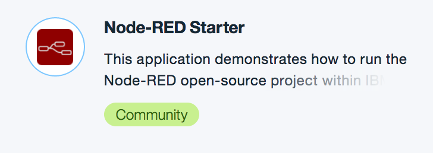
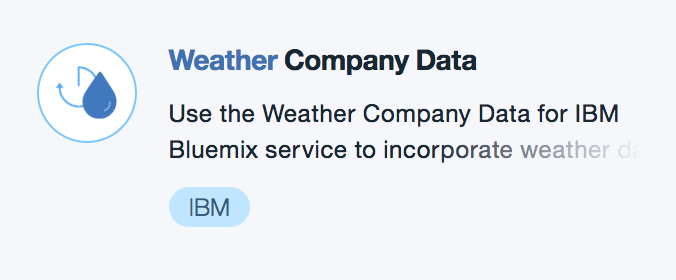
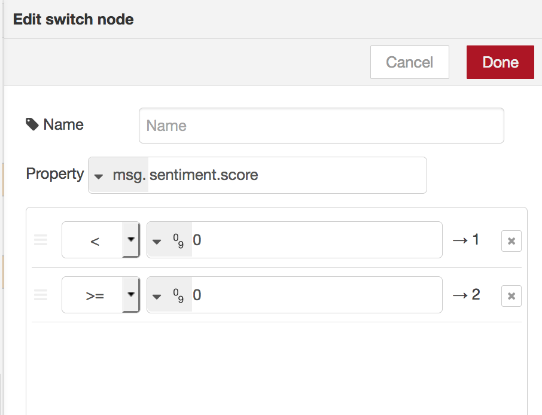
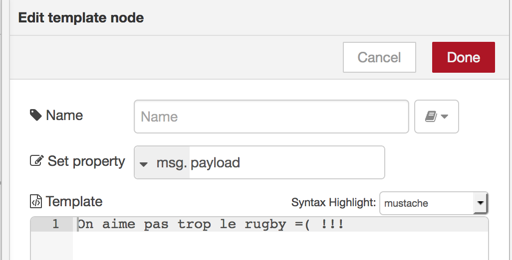
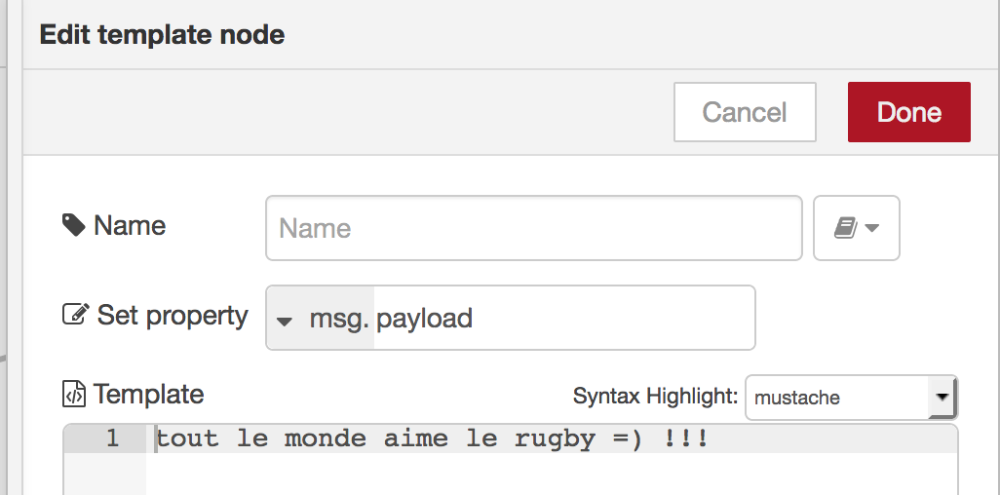

# 5. Lab Node-RED - Advanced - Introduction

This tutorial demonstrates how to use the Node-RED [Node-RED](http://www.nodered.org) tool for wiring together APIs, data and code.

  

# Objectives
* You will create and bind new services to your app.
* You will create new flows in Node-RED.

# Pre-Requisites
* A [Bluemix](http://www.bluemix.net) account

# Use a Node-RED application

If you already created an app from the Internet of Things Platform Starter or from the Node-RED boilerplate, you don't need to create a new app. Just browse your Node-RED app and open a new tab.

If you don't have any Node-RED app, please create an app in bluemix from the **Node-RED boilerplate**

  

# Use The Weather Company Data service

1. Get the Weather credentials provided by your instructor

  

1. Open the weather node and configure with Lat and Lng. You wimm keep the option **Daily Forecast (10 days)**

1. Open the debug node and write **forecasts** instead of **payload**

1. Deploy and clik on the inject node to start the flow:

You see in the debug tab, all informations about the forecasts. Weather data can be used in many use cases.
It can be stored in a database, analyzed ...

  

If you have some problem using the weather node, you can also use a "http request" node and configure your http call, looking at the rest API documentation: https://console.bluemix.net/docs/services/Weather/weather_rest_apis.html#rest_apis

# Feel free to try any other node to analyze these data

# Use the Twitter sentiment

1. Open your Node-RED app and drag and drop the Twitter input node, the sentiment node, a switch node, two templates nodes and a debug node. Wire them together like the following flow:

  

1. Configure the Twitter node, adding your Twitter credentials and looking for a hashtag like **#Rugby**

1. Open the switch node and configure as follow:

  

1. Configure the tamplates 1 and 2 depending of the output:

  
  

1. Deploy and look at the debug tab. You can add another debug node after the tweet node to watch the tweets.

# Create a web page showing the Twitter sentiment

You can create web pages and nice visualization with node-red.

1. On your Node-RED, you can import existing code. Click on the menu top and right and click import->clipboard
2. Copy paste this D3 display flow to your node-red: https://flows.nodered.org/flow/4c01e78d4d97a498e2fea857d3a2ebc4
3. Configure the Twitter node with your account, chose a #, and analyse "all public teets". Configure the Cloudant DB, give a name to the db.
4. Browse <yourappurl>/twittersentiments

5. You can browse other libraries at: https://flows.nodered.org/
